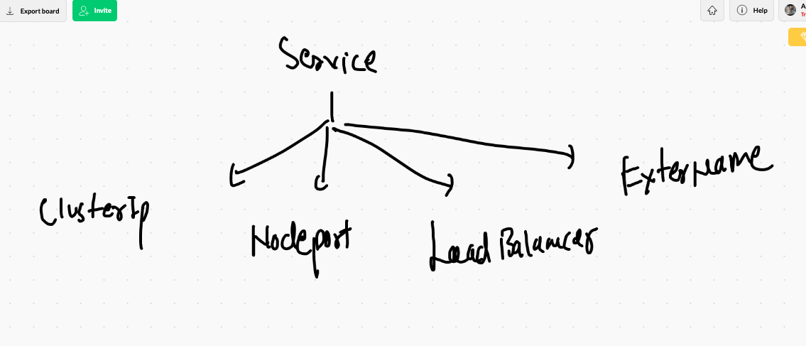
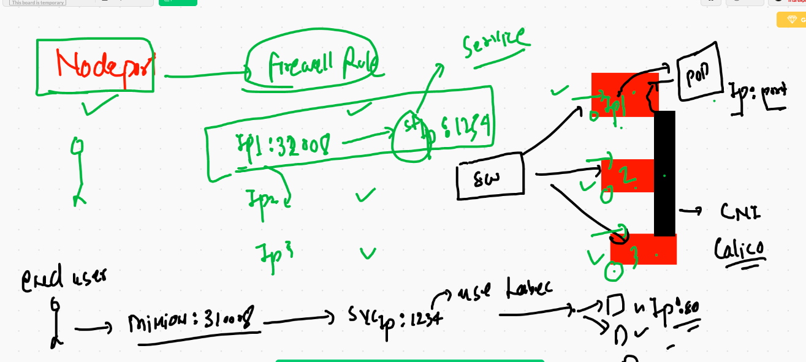
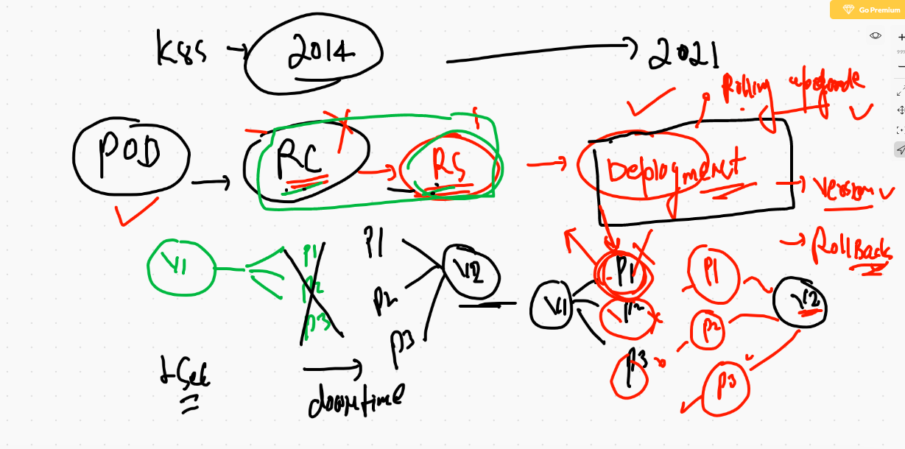
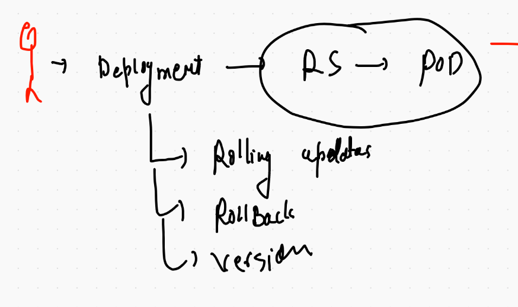

# Certifications 


## POD deletion 

```
❯ kubectl   delete pods --all
pod "ashu-pod-1" deleted
pod "ashupod2" deleted
pod "dhavalpod1" deleted
pod "dhavalpod2" deleted
pod "rajeev-pod-1" deleted
pod "rajeevpod" deleted
pod "rajupod1" deleted
pod "rajupod3" deleted
```

## creation of PODs 

```
❯ kubectl  get po
NAME           READY   STATUS    RESTARTS   AGE
ashu-pod-1     1/1     Running   0          47s
rajupod1       1/1     Running   0          14s
yogesh-pod-1   1/1     Running   0          13s
❯ kubectl  get po ashu-pod-1  -o wide
NAME         READY   STATUS    RESTARTS   AGE   IP               NODE          NOMINATED NODE   READINESS GATES
ashu-pod-1   1/1     Running   0          57s   192.168.27.211   k8s-minion2   <none>           <none>
❯ kubectl  get po ashu-pod-1  --show-labels
NAME         READY   STATUS    RESTARTS   AGE   LABELS
ashu-pod-1   1/1     Running   0          66s   x=helloashu
❯ kubectl  get po   --show-labels
NAME           READY   STATUS              RESTARTS   AGE   LABELS
ashu-pod-1     1/1     Running             0          88s   x=helloashu
rajeev-pod-1   0/1     ContainerCreating   0          2s    x=hellorajeev
rajupod1       1/1     Running             0          55s   x=raju_l1
yogesh-pod-1   1/1     Running             0          54s   x=helloyogesh


```


## listing out all api resources that k8s support

```
❯ kubectl  api-resources
NAME                              SHORTNAMES   APIVERSION                             NAMESPACED   KIND
bindings                                       v1                                     true         Binding
componentstatuses                 cs           v1                                     false        ComponentStatus
configmaps                        cm           v1                                     true         ConfigMap
endpoints                         ep           v1                                     true         Endpoints
events                            ev           v1                                     true         Event
limitranges                       limits       v1                                     true         LimitRange
namespaces                        ns           v1                                     false        Namespace
nodes                             no           v1                                     false        Node
persistentvolumeclaims            pvc          v1                                     true         PersistentVolumeClaim
persistentvolumes                 pv           v1                                     false        PersistentVolume
pods                              po           v1                                     true         Pod
podtemplates                                   v1                      

```


## POD more info 

```
❯ kubectl  describe pod ashu-pod-1
Name:         ashu-pod-1
Namespace:    default
Priority:     0
Node:         k8s-minion2/172.31.81.216
Start Time:   Thu, 21 Jan 2021 10:01:22 +0530
Labels:       x=helloashu
Annotations:  cni.projectcalico.org/podIP: 192.168.27.211/32
              cni.projectcalico.org/podIPs: 192.168.27.211/32
Status:       Running
IP:           192.168.27.211
IPs:
  IP:  192.168.27.211
Containers:
  ashuc1:
    Container ID:   docker://9e8dc6546ebb7cab602a1f93d710c908970388ff5c036f0e19aada3330d73acc
    Image:          nginx
    Image ID:       docker-pullable://nginx@sha256:10b8cc432d56da8b61b070f4c7d2543a9ed17c2b23010b43af434fd40e2ca4aa
    Port:           80/TCP
    Host Port:      0/TCP
    State:          Running
      Started:      Thu, 21 Jan 2021 10:01:24 +0530
      
```

## service type in k8s



## Nodeport 



## nodeport creation 

```
❯ kubectl  create  service  nodeport  ashusvc1  --tcp  1234:80  --dry-run=client -o yaml
apiVersion: v1
kind: Service
metadata:
  creationTimestamp: null
  labels:
    app: ashusvc1
  name: ashusvc1
spec:
  ports:
  - name: 1234-80
    port: 1234
    protocol: TCP
    targetPort: 80
  selector:
    app: ashusvc1
  type: NodePort
status:
  loadBalancer: {}
❯ kubectl  create  service  nodeport  ashusvc1  --tcp  1234:80  --dry-run=client -o yaml  >ashusvc1.yaml

```

## service deployment 

```
❯ kubectl apply -f ashusvc1.yaml
service/ashusvc1 created
❯ kubectl  get  service
NAME         TYPE        CLUSTER-IP       EXTERNAL-IP   PORT(S)          AGE
ashusvc1     NodePort    10.109.119.122   <none>        1234:32376/TCP   10s
kubernetes   ClusterIP   10.96.0.1        <none>        443/TCP          19h
❯ kubectl  get  service
NAME            TYPE        CLUSTER-IP       EXTERNAL-IP   PORT(S)          AGE
ashusvc1        NodePort    10.109.119.122   <none>        1234:32376/TCP   47s
dhpsvc1         NodePort    10.111.174.162   <none>        4567:32662/TCP   2s
kubernetes      ClusterIP   10.96.0.1        <none>        443/TCP          19h
rajeevc1        NodePort    10.102.64.6      <none>        1235:30974/TCP   21s
santhoshisvc1   NodePort    10.110.169.29    <none>        1261:30971/TCP   22s
seshasvc1       NodePort    10.101.177.128   <none>        2345:31682/TCP   6s
yogeshsvc1      NodePort    10.104.99.50     <none>        9876:31330/TCP   32s

```

## service ip 

```
❯ kubectl get svc -o wide
NAME            TYPE        CLUSTER-IP       EXTERNAL-IP   PORT(S)          AGE   SELECTOR
ashusvc1        NodePort    10.109.119.122   <none>        1234:32376/TCP   22m   x=helloashu
dhpsvc1         NodePort    10.111.174.162   <none>        4567:32662/TCP   22m   x=helloadhp
kubernetes      ClusterIP   10.96.0.1        <none>        443/TCP          20h   <none>
rajeevc1        NodePort    10.102.64.6      <none>        1235:30974/TCP   22m   x=hellorajeev
raju-svc1       NodePort    10.106.203.183   <none>        1234:30007/TCP   19m   x=raju_l1
santhoshisvc1   NodePort    10.110.169.29    <none>        1261:30971/TCP   22m   x=hellosanthoshi
satsvc1         NodePort    10.98.115.45     <none>        1234:32697/TCP   21m   x=satlab1


```

## Deleting pod and services

```
❯ kubectl delete pods --all
pod "ashu-pod-1" deleted
pod "dhp-pod-1" deleted
pod "rajeev-pod-1" deleted
pod "rajupod1" deleted
pod "santhoshi-pod-1" deleted
pod "sat-1" deleted
pod "sat-2" deleted
pod "saurav-pod-1" deleted
pod "seshapod1" deleted
pod "skm-pod-3" deleted
pod "sony-pod-1" deleted
pod "yogesh-pod-1" deleted
❯ kubectl delete svc --all
service "ashusvc1" deleted
service "dhpsvc1" deleted
service "kubernetes" deleted
service "rajeevc1" deleted
service "raju-svc1" deleted
service "santhoshisvc1" deleted
service "satsvc1" deleted
service "sauravsvc1" deleted
service "seshasvc1" deleted
service "sonyvc1" deleted
service "yogeshsvc1" deleted

```

# Replication controller

```
apiVersion: v1
kind: ReplicationController
metadata:
 name: ashu-rc-1
 labels:  # label of RC 
  x: helloashurc
spec:
 replicas: 1 #  need one Pod
 template: # use this template to create no of pod replica
  metadata:
   labels:
    x: helloashurcc  # label of all the POD created by RC 
  spec:
   containers:
  - image: dockerashu/ashujsp:v1 
    name: ashuc1 
    ports:
    - containerPort: 80 # application port
    
 ```
 
 
 ## deployment of RC
 
 ```
 ❯ kubectl apply -f ashurc1.yaml
replicationcontroller/ashu-rc-1 created
❯ 
❯ kubectl  get   replicationcontroller
NAME        DESIRED   CURRENT   READY   AGE
ashu-rc-1   1         1         0       10s
sat-rc-1    1         1         0       14s
❯ 
❯ kubectl  get    rc
NAME        DESIRED   CURRENT   READY   AGE
ashu-rc-1   1         1         1       16s
sat-rc-1    1         1         1       20s

```

## replacing any yaml api resource

```
❯ kubectl replace -f ashurc1.yaml --force
replicationcontroller "ashu-rc-1" deleted
replicationcontroller/ashu-rc-1 replaced
❯ kubectl replace -f ashusvc1.yaml --force
service "ashusvc1" deleted
service/ashusvc1 replaced

```

## Expose RC to create service with matched label of POD

```
❯ kubectl  expose  rc  ashu-rc-1   --type NodePort --port 1234 --target-port 8080 --name ashusvc2
service/ashusvc2 exposed
❯ kubectl  get  svc
NAME            TYPE        CLUSTER-IP       EXTERNAL-IP   PORT(S)          AGE
ashusvc2        NodePort    10.111.38.236    <none>        1234:30101/TCP   23s

```

## scaling pod using RC 

```
❯ kubectl  scale  rc  ashu-rc-1  --replicas=5
replicationcontroller/ashu-rc-1 scaled
❯ kubectl  get  rc  ashu-rc-1
NAME        DESIRED   CURRENT   READY   AGE
ashu-rc-1   5         5         5       22m
❯ kubectl  scale  rc  ashu-rc-1  --replicas=2
replicationcontroller/ashu-rc-1 scaled
❯ kubectl  get  rc  ashu-rc-1
NAME        DESIRED   CURRENT   READY   AGE
ashu-rc-1   2         2         2       22m

```

## history 

```
 4072  kubectl  get po --show-labels
 4073  kubectl  get po ashu-rc-1-l426k   --show-labels
❯ kubectl delete  rc  ashu-rc-1
replicationcontroller "ashu-rc-1" deleted
❯ kubectl delete all --all

```

## introduction to deployment api resource in k8s




## reality of deployment 



## creating deployemnt 

```
❯ kubectl create  deployment  ashu-depweb --image=dockerashu/jan2021:webv1 --dry-run=client -o yaml
apiVersion: apps/v1
kind: Deployment
metadata:
  creationTimestamp: null
  labels:
    app: ashu-depweb
  name: ashu-depweb
spec:
  replicas: 1
  selector:
    matchLabels:
      app: ashu-depweb
  strategy: {}
  template:
    metadata:
      creationTimestamp: null
      labels:
        app: ashu-depweb
    spec:
      containers:
      - image: dockerashu/jan2021:webv1
        name: jan2021
        resources: {}
status: {}
❯ kubectl create  deployment  ashu-depweb --image=dockerashu/jan2021:webv1 --dry-run=client -o yaml >ashudep.yml


```


## checking deployment 

```
❯ kubectl get deploy
NAME               READY   UP-TO-DATE   AVAILABLE   AGE
ashu-depweb        1/1     1            1           32s
dhp-webapp         0/1     1            0           1s
rajeev-deployweb   1/1     1            1           6s
rajeev-depweb      1/1     1            1           3m9s
raju-depweb        1/1     1            1           81s
santhoshi-depweb   1/1     1            1           2m8s
sat-depweb         1/1     1            1           5s
skm-depweb         1/1     1            1           76s
sony-depweb        1/1     1            1           18s
❯ kubectl  get  rs
NAME                          DESIRED   CURRENT   READY   AGE
ashu-depweb-54f9bb9fc4        1         1         1       36s
dhp-webapp-767d45d94c         1         1         1       5s
rajeev-deployweb-bd7f777c6    1         1         1       10s
rajeev-depweb-6549c8ccd6      1         1         1       3m13s
raju-depweb-79f84968bc        1         1         1       85s
santhoshi-depweb-8548c7964b   1         1         1       2m12s
sat-depweb-ddc958b7f          1         1         1       9s
skm-depweb-6f8bcb8b8          1         1         1       80s
sony-depweb-67bc9fb758        1         1         1       22s
❯ kubectl  get  po
NAME                                READY   STATUS    RESTARTS   AGE
ashu-depweb-54f9bb9fc4-vfnqs        1/1     Running   0          41s
dhp-webapp-767d45d94c-t7t8m         1/1     Running   0          10s
rajeev-deployweb-bd7f777c6-7xb2p    1/1     Running   0          15s
rajeev-depweb-6549c8ccd6-dwctl      1/1     Running   0          3m18s
raju-depweb-79f84968bc-nf8d9        1/1     Running   0          90s
santhoshi-depweb-8548c7964b-85dp4   1/1     Running   0          2m17s
sat-depweb-ddc958b7f-bg8w8          1/1     Running   0          14s
skm-depweb-6f8bcb8b8-fjrp8          1/1     Running   0          85s
sony-depweb-67bc9fb758-2fptx        1/1     Running   0          27s

```


# Deployment 

```
❯ kubectl apply -f ashudep.yml
deployment.apps/ashu-depweb created
❯ kubectl  get  deploy
NAME          READY   UP-TO-DATE   AVAILABLE   AGE
ashu-depweb   1/1     1            1           5s
dhp-webapp    1/1     1            1           67s
❯ kubectl expose deployment ashu-depweb  --type NodePort --port 1234 --target-port 80 --name ashusvc5
service/ashusvc5 exposed
❯ kubectl  get  svc
NAME           TYPE        CLUSTER-IP      EXTERNAL-IP   PORT(S)          AGE
ashusvc5       NodePort    10.97.188.68    <none>        1234:30701/TCP   4s
dhpsvc3-dep1   NodePort    10.104.223.82   <none>        2345:31896/TCP   68s
kubernetes     ClusterIP   10.96.0.1       <none>        443/TCP          6m40s
yogeshsvc1     NodePort    10.106.247.65   <none>        9876:30007/TCP   24s
❯ kubectl  get  rs
NAME                         DESIRED   CURRENT   READY   AGE
ashu-depweb-54f9bb9fc4       1         1         1       2m11s
dhp-webapp-767d45d94c        1         1         1       3m13s
rajeev-deployweb-bd7f777c6   1         1         1       113s
saurav-debweb-6b99859ff7     1         1         1       113s

```
## checking revesion number 

```
❯ kubectl  describe deployment  ashu-depweb
Name:                   ashu-depweb
Namespace:              default
CreationTimestamp:      Thu, 21 Jan 2021 14:33:02 +0530
Labels:                 app=ashu-depweb
Annotations:            deployment.kubernetes.io/revision: 1
Selector:               app=ashu-depweb
Replicas:               1 desired | 1 updated | 1 total | 1 available | 0 unavailable
StrategyType:           RollingUpdate
MinReadySeconds:        0
RollingUpdateStrategy:  25% max unavailable, 25% max surge
Pod Template:
  Labels:  app=ashu-depweb
  Containers:


```

## scaling deployment 

```
❯ kubectl  scale deploy  ashu-depweb --replicas=3
deployment.apps/ashu-depweb scaled
❯ kubectl  get deploy
NAME               READY   UP-TO-DATE   AVAILABLE   AGE
ashu-depweb        3/3     3            3           11m

```

## updating application version via image 

```
kubectl  set image  deployment  ashu-depweb jan2021=dockerashu/jan2021:webv2 

```

## checking version history 

```
❯ kubectl  rollout history deployment ashu-depweb
deployment.apps/ashu-depweb 
REVISION  CHANGE-CAUSE
1         <none>
2         <none>

❯ kubectl  describe deployment  ashu-depweb
Name:                   ashu-depweb
Namespace:              default
CreationTimestamp:      Thu, 21 Jan 2021 14:33:02 +0530
Labels:                 app=ashu-depweb
Annotations:            deployment.kubernetes.io/revision: 2
Selector:               app=ashu-depweb
Replicas:               3 desired | 3 updated | 3 total | 3 available | 0 unavailable
StrategyType:           RollingUpdate
MinReadySeconds:        0
RollingUpdateStrategy:  25% max unavailable, 25% max surge

```

## rolling back 

```
❯ kubectl rollout  undo  deployment  ashu-depweb  --to-revision=1
deployment.apps/ashu-depweb rolled back

```


## deployment history 

```
 4129* kubectl  describe deployment  ashu-depweb 
 4130* kubectl  set image  deployment  ashu-depweb jan2021=dockerashu/jan2021:webv2
 4131* history
 4132* kubectl  describe deployment  ashu-depweb 
 4133* history
 4134* kubectl  rollout history deployment ashu-depweb 
 4135* kubectl  describe deployment  ashu-depweb 
 4136* history
 4137  docker build  -t  dockerashu/jan2021:webv3  https://github.com/redashu/beginner-html-site-styled.git\#gh-pages
 4138  docker push dockerashu/jan2021:webv3
 4139  history
 4140  kubectl  set image  deployment  ashu-depweb jan2021=dockerashu/jan2021:webv3
 4141  kubectl  rollout history deployment ashu-depweb 
 4142  kubectl  describe deployment  ashu-depweb 
❯ kubectl rollout  undo  deployment  ashu-depweb  --to-revesion=1

```


