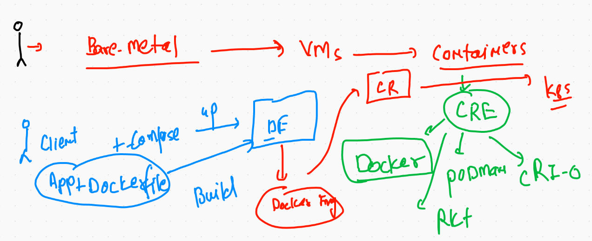
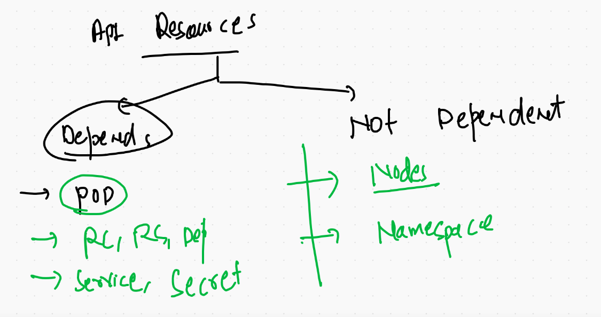
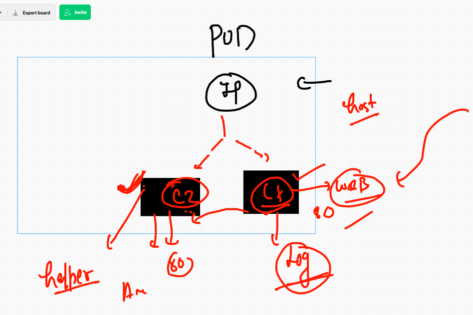

# Container process summary 




# Namespace in k8s

```
❯ kubectl  get  namespace
NAME              STATUS   AGE
default           Active   43h
kube-node-lease   Active   43h
kube-public       Active   43h
kube-system       Active   43h
❯ kubectl  get  ns
NAME              STATUS   AGE
default           Active   43h
kube-node-lease   Active   43h
kube-public       Active   43h
kube-system       Active   43h

```

# kube-system namespace 

```
❯ kubectl  get  po  -n kube-system
NAME                                       READY   STATUS    RESTARTS   AGE
calico-kube-controllers-744cfdf676-c2zpv   1/1     Running   2          43h
calico-node-5mt7m                          1/1     Running   2          43h
calico-node-9nrw6                          1/1     Running   2          43h
calico-node-mctqs                          1/1     Running   2          43h
calico-node-sw9rg                          1/1     Running   2          43h
coredns-74ff55c5b-2gvn7                    1/1     Running   2          43h
coredns-74ff55c5b-tq7pd                    1/1     Running   2          43h
etcd-k8s-master                            1/1     Running   2          43h
kube-apiserver-k8s-master                  1/1     Running   2          43h
kube-controller-manager-k8s-master         1/1     Running   2          43h
kube-proxy-4dkgg                           1/1     Running   2          43h
kube-proxy-h5s4r                           1/1     Running   2          43h
kube-proxy-lk2qb                           1/1     Running   2          43h
kube-proxy-rm4gv                           1/1     Running   2          43h
kube-scheduler-k8s-master                  1/1     Running   2          43h


```

## namespace dependency 



## create custom namespace 

```
❯ kubectl  create  namespace  ashu-space --dry-run=client -o yaml
apiVersion: v1
kind: Namespace
metadata:
  creationTimestamp: null
  name: ashu-space
spec: {}
status: {}
❯ kubectl  create  namespace  ashu-space
namespace/ashu-space created
❯ kubectl  get  ns
NAME              STATUS   AGE
ashu-space        Active   6s
default           Active   43h
kube-node-lease   Active   43h
kube-public       Active   43h
kube-system       Active   43h

```

## Expose deployment to create service 

```
 kubectl  expose deployment  ashu-depweb --type NodePort --port 80 --name mysvc1  -n ashu-space
 
```

###

```
❯ kubectl  get  all  -n ashu-space
NAME                               READY   STATUS    RESTARTS   AGE
pod/ashu-depweb-75869959fb-fvws6   1/1     Running   0          11m

NAME             TYPE       CLUSTER-IP       EXTERNAL-IP   PORT(S)        AGE
service/mysvc1   NodePort   10.104.132.255   <none>        80:30032/TCP   6m48s

NAME                          READY   UP-TO-DATE   AVAILABLE   AGE
deployment.apps/ashu-depweb   1/1     1            1           11m

NAME                                     DESIRED   CURRENT   READY   AGE
replicaset.apps/ashu-depweb-75869959fb   1         1         1       11m

```


## Package YAML 

```
# creating name space 
apiVersion: v1
kind: Namespace
metadata:
 name: ashutest1

#  creating POD 

--- 
apiVersion: v1
kind: Pod
metadata:
 name: ashupod123
 Namespace: ashutest1
 labels:
  x: helloashu101
spec:
 containers:
 - image: nginx
   name: ashuc1
   ports:
   - containerPort: 80
# creating service 
---
apiVersion: v1
kind: Service
metadata:
 name: ashusvc111
 Namespace: ashutest1
spec:
 ports:
 - name: ashuport
   port: 1234
   targetPort: 80
   protocol: TCP
 type: NodePort
 Selector:
   x: helloashu101 
   
   
```

# VOlumes in k8s

## EmptyDir volume 

```
kubectl  run  ashupod1  --image=alpine  --namespace ashu-space --dry-run=client -o yaml  >ashuemppod.yml

```

## yaml of EmptyDir type 

```
apiVersion: v1
kind: Pod
metadata:
  creationTimestamp: null
  labels:
    run: ashupod1
  name: ashupod1
  namespace: ashu-space
spec:
  nodeName: k8s-minion2 # scheduling pod in minion 2 
  volumes: # creation of volumes 
  - name: ashuvol1 # name of volume 
    emptyDir: {} # type of Volume 
  containers:
  - image: alpine
    name: ashupod1
    volumeMounts:  # mount volume that we created above 
    - name: ashuvol1  # name of volume
      mountPath: /mnt/data  # path inside container 
    resources: {}
  dnsPolicy: ClusterFirst
  restartPolicy: Always
status: {}

```

##  access the pod 

```
❯ kubectl exec -it ashupod1  -n ashu-space  -- sh
/ # ps  -e
PID   USER     TIME  COMMAND
    1 root      0:00 /bin/sh -c while true;do date >>/mnt/data/time.txt; sleep 3;done
   21 root      0:00 sleep 3
   22 root      0:00 sh
   28 root      0:00 ps -e
/ # cd   /mnt/data/
/mnt/data # ls
time.txt
/mnt/data # cat  time.txt 
Fri Jan 22 06:30:32 UTC 2021
Fri Jan 22 06:30:35 UTC 2021
Fri Jan 22 06:30:38 UTC 2021
Fri Jan 22 06:30:41 UTC 2021

```

## Pod with multiple container 



## multi Pod container 

```
apiVersion: v1
kind: Pod
metadata:
  creationTimestamp: null
  labels:
    run: ashupod1
  name: ashupod1
  namespace: ashu-space
spec:
  nodeName: k8s-minion2 # scheduling pod in minion 2 
  volumes: # creation of volumes 
  - name: ashuvol1 # name of volume 
    emptyDir: {} # type of Volume 
  containers:
  - image: nginx 
    name: ashuc2
    ports:
    - containerPort: 80
    volumeMounts:
    - name: ashuvol1
      mountPath: /usr/share/nginx/html/ # app hosting location 
  - image: alpine   #  helper container 
    name: ashupod1  # name of container for data generation purpose 
    command: ["/bin/sh","-c","while true;do date >>/mnt/data/index.html; sleep 3;done"] # parent process of container 
    volumeMounts:  # mount volume that we created above 
    - name: ashuvol1  # name of volume
      mountPath: /mnt/data  # path inside container 
    resources: {}
  dnsPolicy: ClusterFirst
  restartPolicy: Always
status: {}

```


