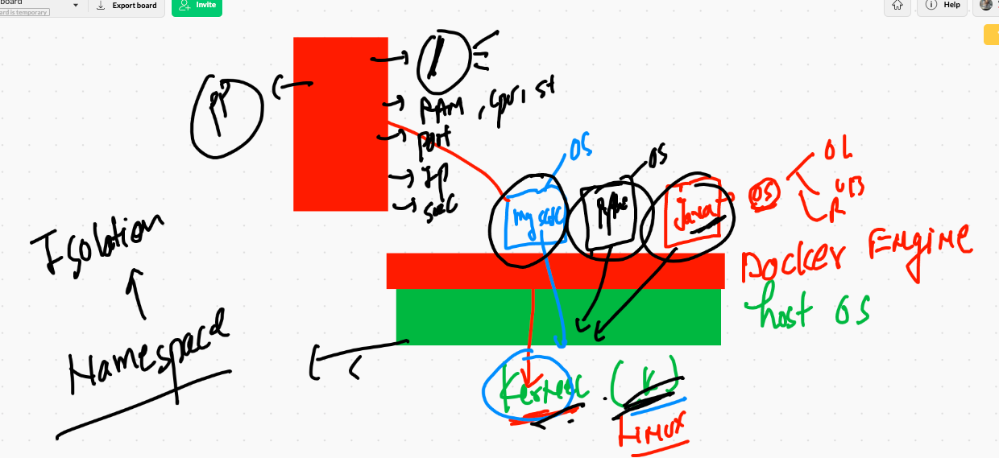
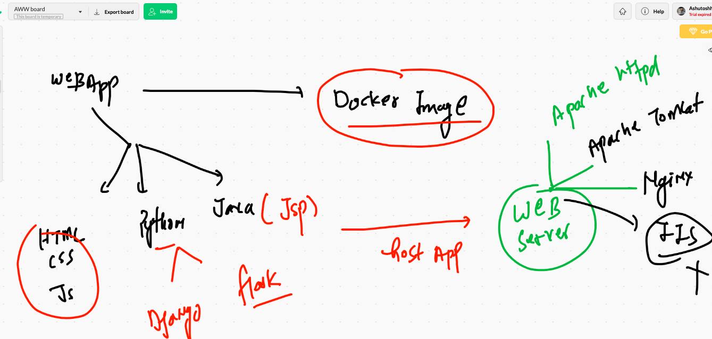
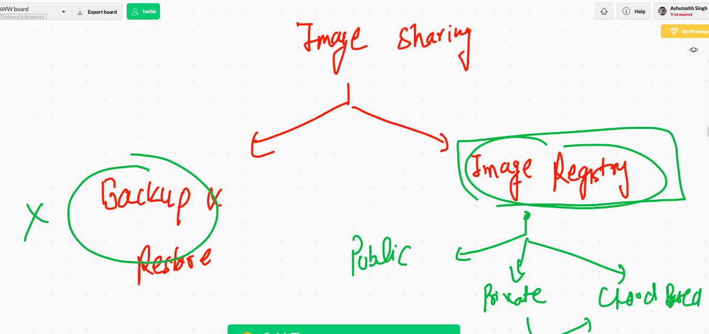
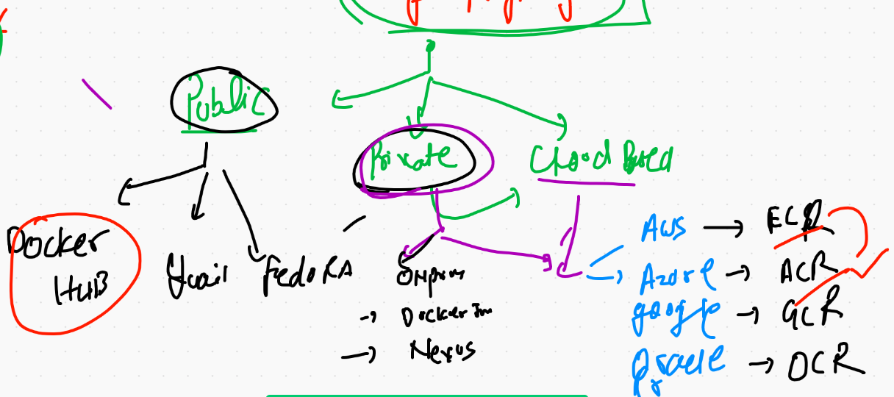
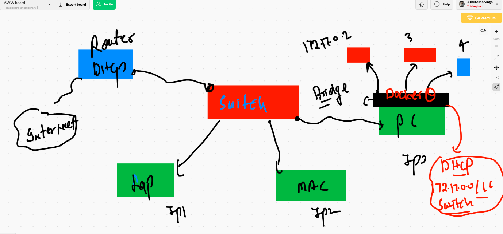
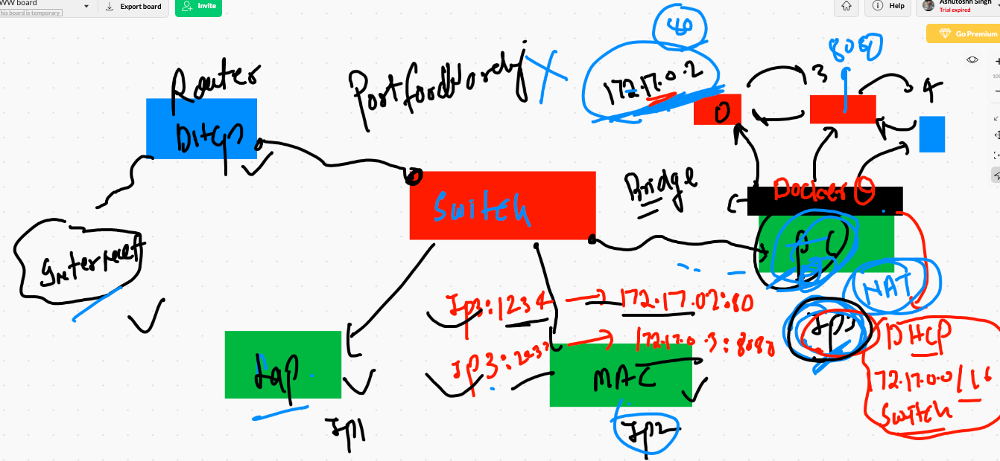

# Docker Namespaces 



## Cgroups in containers

```
267  docker run -d --name x1  alpine ping fb.com 
  268  docker  ps 
  269  docker  stats x1 
  270  history 
  271  docker  stats 
  272  history 
  273  docker ps
  274  docker run -d --name x3  --memory 100m   alpine ping fb.com 
  
 ```
 
 ## CPU and ram limiting 
 
 ```
 282  docker run -d --name x4  --cpuset-cpus=0 --cpu-shares=20   alpine ping fb.com 
  283  docker run -d --name x5  --cpuset-cpus=0 --cpu-shares=20  -m 200m  alpine ping fb.com
  
```


## web servers 



## TOmcat Dockerfile

```
FROM tomcat 
MAINTAINER  ashutoshh@linux.com
WORKDIR  /usr/local/tomcat/webapps
RUN mkdir app
WORKDIR  app
COPY myapp .
RUN chmo 755 /usr/local/tomcat/webapps/app -R 
EXPOSE 8080

```


## building image

```
[ec2-user@ip-172-31-81-232 javawebapp]$ docker build  -t  ashujsp:v1  .
Sending build context to Docker daemon   7.68kB
Step 1/8 : FROM tomcat
 ---> 040bdb29ab37
Step 2/8 : MAINTAINER  ashutoshh@linux.com
 ---> Running in 567ad6c72b9a
Removing intermediate container 567ad6c72b9a
 ---> e2d39bb03d33
Step 3/8 : WORKDIR  /usr/local/tomcat/webapps
 ---> Running in c4bee97c160e
Removing intermediate container c4bee97c160e
 ---> 881232f85fc6
Step 4/8 : RUN mkdir app
 ---> Running in 03c9e2d1402f
Removing intermediate container 03c9e2d1402f
 ---> 1945e72e2722
Step 5/8 : WORKDIR  app
 ---> Running in 65c3e46fdca0
Removing intermediate container 65c3e46fdca0
 ---> 554e1c17c148
Step 6/8 : COPY myapp .
 ---> 0cce337be5e0
Step 7/8 : RUN chmod 755 /usr/local/tomcat/webapps/app -R
 ---> Running in 9146d94cdeca


```


## Springboot app with maven in Dockerifle

```
[ec2-user@ip-172-31-81-232 project-java-spring-webapp]$ cat Dockerfile 
FROM tomcat
MAINTAINER ashutoshh@linux.com
WORKDIR  /usr/local/tomcat/
RUN mkdir app
WORKDIR  app
ADD  .  .
RUN  apt  update -y
RUN apt install maven -y
RUN mvn clean package
# will connect to automated server on internet and build package to war file 
# this may take time depending on speed of compilation
RUN mv * /usr/local/tomcat/webapps/
EXPOSE 8080 
[ec2-user@ip-172-31-81-232 project-java-spring-webapp]$ ls  -a
.  ..  Dockerfile  LICENSE  Readme.md  pom.xml  src
[ec2-user@ip-172-31-81-232 project-java-spring-webapp]$ vim .dockerignore
[ec2-user@ip-172-31-81-232 project-java-spring-webapp]$ cat .dockerignore 
*.md
Dockerfile
.dockerignore
LICENSE
.git

```


# image sharing 



## more closure look 



## pushing image on docker hub 

```
352  docker  login  
  353  docker  images  |   grep -i ashu
  354  docker  tag  ashujsp:v1    dockerashu/ashujsp:v1  
  355  docker  images  |   grep -i ashu
  356  docker  push  dockerashu/ashujsp:v1  
  357  docker  logout 

```


# Docker Networking 



## checking container IP and connection 

```
[ec2-user@ip-172-31-81-232 ~]$ docker  ps
CONTAINER ID        IMAGE               COMMAND             CREATED              STATUS              PORTS               NAMES
813e7b617085        alpine              "ping google.com"   3 seconds ago        Up 2 seconds                            s1
4ba42105e102        alpine              "ping fb.com"       About a minute ago   Up About a minute                       x2
c061dccee04a        alpine              "ping fb.com"       About a minute ago   Up About a minute                       x1
[ec2-user@ip-172-31-81-232 ~]$ docker  exec -it  x1  sh 
/ # 
/ # ifconfig 
eth0      Link encap:Ethernet  HWaddr 02:42:AC:11:00:02  
          inet addr:172.17.0.2  Bcast:172.17.255.255  Mask:255.255.0.0
          UP BROADCAST RUNNING MULTICAST  MTU:1500  Metric:1
          RX packets:238 errors:0 dropped:0 overruns:0 frame:0
          TX packets:220 errors:0 dropped:0 overruns:0 carrier:0
          collisions:0 txqueuelen:0 
          RX bytes:22068 (21.5 KiB)  TX bytes:20768 (20.2 KiB)

lo        Link encap:Local Loopback  
          inet addr:127.0.0.1  Mask:255.0.0.0
          UP LOOPBACK RUNNING  MTU:65536  Metric:1
          RX packets:0 errors:0 dropped:0 overruns:0 frame:0
          TX packets:0 errors:0 dropped:0 overruns:0 carrier:0
          collisions:0 txqueuelen:1000 
          RX bytes:0 (0.0 B)  TX bytes:0 (0.0 B)

/ # ping 172.17.0.3
PING 172.17.0.3 (172.17.0.3): 56 data bytes
64 bytes from 172.17.0.3: seq=0 ttl=255 time=0.109 ms
64 bytes from 172.17.0.3: seq=1 ttl=255 time=0.082 ms
^C

```

## NAT and port forwarding 



## creating and exploring bridge

```
[ec2-user@ip-172-31-81-232 ~]$ docker  network  create  ashubr1 
2f2458bbe0529171c06f33551240470a245df9f79393c0cca854dcf9a67c281f
[ec2-user@ip-172-31-81-232 ~]$ docker  network  ls
NETWORK ID          NAME                DRIVER              SCOPE
1c70f0a25cdf        Sesha1              bridge              local
05988b25929f        anushabr1           bridge              local
2f2458bbe052        ashubr1             bridge              local
92dfb6a64e2e        bridge              bridge              local
4eadcacc86da        host                host                local
12de8cdf3849        none                null                local
810cddd6aab5        rajeevbr1           bridge              local
[ec2-user@ip-172-31-81-232 ~]$ docker  network inspect  bridge 
[
    {
        "Name": "bridge",
        "Id": "92dfb6a64e2e2e9502eccdaac4295025a18674ae771d708709462f08f8e7f4c1",
        "Created": "2021-01-19T03:54:05.386392587Z",
        "Scope": "local",
        "Driver": "bridge",
        "EnableIPv6": false,
        "IPAM": {
            "Driver": "default",
            "Options": null,
            "Config": [
                {
                    "Subnet": "172.17.0.0/16",
                    "Gateway": "172.17.0.1"
                }
            ]
        },
        "Internal": false,
        "Attachable": false,
        "Ingress": false,
        "ConfigFrom": {
            "Network": ""
        },
        "ConfigOnly": false,
        "Containers": {
            "4ba42105e102e1b486f6d98341a5ae4ec82d5081fe59f9b3c6009b23b9f3d154": {
                "Name": "x2",
                "EndpointID": "46f3e5099b2e67a340985cb54f5bc13c8b5e5e7d98959f3ab334be0161dd38cd",
                "MacAddress": "02:42:ac:11:00:03",
                "IPv4Address": "172.17.0.3/16",
                "IPv6Address": ""
            },
            "813e7b617085f4dcf4d745462d063ecdbf323c99c397fef67734a99b58e25dbb": {
                "Name": "s1",
                "EndpointID": "c2bf40633d3ca4b7fb7374c8959cae64cd475fb5dcc6a29bb3bfe7b40a1c8d3d",
                "MacAddress": "02:42:ac:11:00:04",
                "IPv4Address": "172.17.0.4/16",
                
```

## inspecting bridge

```
[ec2-user@ip-172-31-81-232 ~]$ docker  network inspect  ashubr1
[
    {
        "Name": "ashubr1",
        "Id": "2f2458bbe0529171c06f33551240470a245df9f79393c0cca854dcf9a67c281f",
        "Created": "2021-01-19T07:15:33.177785395Z",
        "Scope": "local",
        "Driver": "bridge",
        "EnableIPv6": false,
        "IPAM": {
            "Driver": "default",
            "Options": {},
            "Config": [
                {
                    "Subnet": "172.18.0.0/16",
                    "Gateway": "172.18.0.1"
                }
            ]
        },
        "Internal": false,
        "Attachable": false,
        "Ingress": false,
        "ConfigFrom": {
            "Network": ""
        },
        "ConfigOnly": false,
        "Containers": {},
        
        
```

## launching containers in bridge

```
  380  docker  network inspect  ashubr1
  381  history 
[ec2-user@ip-172-31-81-232 ~]$ docker run -d --name ashux1 --network ashubr1  alpine ping fb.com 
95f57bc54a4209997058a08cf61c966c65dea966fa840e9f69d2386a8a162828
[ec2-user@ip-172-31-81-232 ~]$ 
[ec2-user@ip-172-31-81-232 ~]$ 
[ec2-user@ip-172-31-81-232 ~]$ docker run -d --name ashux2 --network ashubr1  alpine ping fb.com 
0f69c3f66931505b52e1858f4b2f9a27dc690d654daab1f21d63688d0bd8ef2c
[ec2-user@ip-172-31-81-232 ~]$ docker  network inspect  ashubr1
[
    {
        "Name": "ashubr1",
        "Id": "2f2458bbe0529171c06f33551240470a245df9f79393c0cca854dcf9a67c281f",
        "Created": "2021-01-19T07:15:33.177785395Z",
        "Scope": "local",
        "Driver": "bridge",
        "EnableIPv6": false,
        "IPAM": {
            "Driver": "default",
            "Options": {},
            "Config": [
                {
                    "Subnet": "172.18.0.0/16",
                    "Gateway": "172.18.0.1"
                }
            ]
        },
        "Internal": false,
        "Attachable": false,
        "Ingress": false,
        "ConfigFrom": {
            "Network": ""
        },
        "ConfigOnly": false,
        "Containers": {
            "0f69c3f66931505b52e1858f4b2f9a27dc690d654daab1f21d63688d0bd8ef2c": {
                "Name": "ashux2",
                "EndpointID": "a8bb63293ef099175376fd969e9c0d10885bcb48c1cc63dfd15ff27c7638dfea",
                "MacAddress": "02:42:ac:12:00:03",
                "IPv4Address": "172.18.0.3/16",
                "IPv6Address": ""
            },
            "95f57bc54a4209997058a08cf61c966c65dea966fa840e9f69d2386a8a162828": {
                "Name": "ashux1",
                "EndpointID": "0a66c333f842be7fb76f183bdbfdc84499764bd9a803978bc42096c17d6a1ab2",
                "MacAddress": "02:42:ac:12:00:02",
                "IPv4Address": "172.18.0.2/16",
                "IPv6Address": ""
            }
        },
        "Options": {},
        "Labels": {}
    }


```

## checking connection by name 

```
[ec2-user@ip-172-31-81-232 ~]$ docker  exec -it  ashux1  sh 
/ # ping ashux2
PING ashux2 (172.18.0.3): 56 data bytes
64 bytes from 172.18.0.3: seq=0 ttl=255 time=0.203 ms
64 bytes from 172.18.0.3: seq=1 ttl=255 time=0.108 ms
64 bytes from 172.18.0.3: seq=2 ttl=255 time=0.100 ms
^C
--- ashux2 ping statistics ---
3 packets transmitted, 3 packets received, 0% packet loss
round-trip min/avg/max = 0.100/0.137/0.203 ms

```
