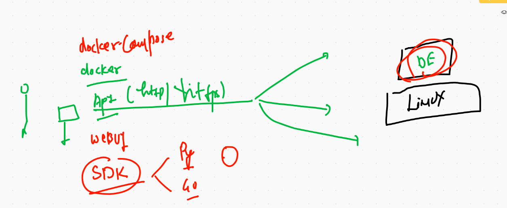

# Docker client options



# Docker compose 

## Cleaning up docker engine 

```
 496  docker  rm  $(docker ps -qa) -f
  497  docker  images
  498  docker rmi $(docker images -q) -f
  499  docker  images
  500  docker  network  rm  $(docker network ls -q)
  
```

## to check compose file version history 

[history] ('https://docs.docker.com/compose/compose-file/')


## Example 1

```
[ec2-user@ip-172-31-81-232 ashucompose1]$ cat  docker-compose.yml 
version: "3.8"  # compose file version 
services:
 ashuapp1:  # to define info about containers 
  image: alpine
  container_name: ashuc1
  command: ping google.com
  
```

## Deploy using compose 

```
[ec2-user@ip-172-31-81-232 ashucompose1]$ docker-compose up -d 
Creating network "ashucompose1_default" with the default driver
Pulling ashuapp1 (alpine:)...
latest: Pulling from library/alpine
596ba82af5aa: Pull complete
Digest: sha256:d9a7354e3845ea8466bb00b22224d9116b183e594527fb5b6c3d30bc01a20378
Status: Downloaded newer image for alpine:latest
Creating ashuc1 ... done
[ec2-user@ip-172-31-81-232 ashucompose1]$ docker-compose ps
 Name        Command       State   Ports
----------------------------------------
ashuc1   ping google.com   Up       

```


## clean up 

```
[ec2-user@ip-172-31-81-232 ashucompose1]$ docker-compose down
Stopping ashuc1 ... done
Removing ashuc1 ... done
Removing network ashucompose1_default

```


## Example 2

```
[ec2-user@ip-172-31-81-232 ashucompose1]$ cat  jsp-compose.yaml 
version: "3.8"
services:
 ashujavaapp1:
  image: ashujsp:v1
  container_name: ashuwb1
  ports:  # is an array object 
   - "2233:8080"
   
```


## Deployment 

```
[ec2-user@ip-172-31-81-232 ashucompose1]$ docker-compose  -f  jsp-compose.yaml    up  -d
Pulling ashujavaapp1 (dockerashu/ashujsp:v1)...
v1: Pulling from dockerashu/ashujsp
b9a857cbf04d: Pull complete
d557ee20540b: Pull complete
3b9ca4f00c2e: Pull complete
667fd949ed93: Pull complete
661d3b55f657: Pull complete
511ef4338a0b: Pull complete
a56db448fefe: Pull complete
00612a99c7dc: Pull complete
326f9601c512: Pull complete
c547db74f1e1: Pull complete
fefc2a019ee0: Pull complete
19b347937c5c: Pull complete
c532444d9622: Pull complete
Digest: sha256:727d8fb7b0895a1c092c840e97c731ee72d35ad366d199b64a47bb3741ad1c3e
Status: Downloaded newer image for dockerashu/ashujsp:v1
Creating ashuwb1 ... done
[ec2-user@ip-172-31-81-232 ashucompose1]$ docker-compose  -f  jsp-compose.yaml    ps
 Name         Command       State           Ports         
----------------------------------------------------------
ashuwb1   catalina.sh run   Up      0.0.0.0:2233->8080/tcp
[ec2-user@ip-172-31-81-232 ashucompose1]$ !cur
curl https://ipinfo.io/json 
{
  "ip": "54.161.225.68",
  "hostname": "ec2-54-161-225-68.compute-1.amazonaws.com",
  "city": "Virginia Beach",
  "region": "Virginia",
  "country": "US",
  "loc": "36.7957,-76.0126",
  "org": "AS14618 Amazon.com, Inc.",
  "postal": "23479",
  "timezone": "America/New_York",
  "readme": "https://ipinfo.io/missingauth"


```

## Example 3 

```
[ec2-user@ip-172-31-81-232 ashucompose1]$ cat portainer.yml 
version: "3.8"
services:
 ashuwebuiapp1:
  image: portainer/portainer
  container_name: ashuwebui
  ports:  # is an array object 
   - "2233:9000"
  volumes:
   - "/var/run/docker.sock:/var/run/docker.sock"
   
 ```
 
 ## Deployment 
 
 ```
 [ec2-user@ip-172-31-81-232 ashucompose1]$ docker-compose -f portainer.yml up  -d
Creating network "ashucompose1_default" with the default driver
Pulling ashuwebuiapp1 (portainer/portainer:)...
latest: Pulling from portainer/portainer
d1e017099d17: Pull complete
717377b83d5c: Pull complete
Digest: sha256:f8c2b0a9ca640edf508a8a0830cf1963a1e0d2fd9936a64104b3f658e120b868
Status: Downloaded newer image for portainer/portainer:latest
Creating ashuwebui ... done
[ec2-user@ip-172-31-81-232 ashucompose1]$ docker-compose -f portainer.yml ps
  Name       Command     State           Ports         
-------------------------------------------------------
ashuwebui   /portainer   Up      0.0.0.0:2233->9000/tcp
[ec2-user@ip-172-31-81-232 ashucompose1]$ docker-compose -f portainer.yml  logs
Attaching to ashuwebui
ashuwebui        | 2021/01/20 04:56:25 Warning: the --template-file flag is deprecated and will likely be removed in a future version of Portainer.
ashuwebui        | 2021/01/20 04:56:25 server: Reverse tunnelling enabled
ashuwebui        | 2021/01/20 04:56:25 server: Fingerprint 77:b4:c3:10:69:07:49:b4:17:13:a8:f0:7e:7e:bc:cf
ashuwebui        | 2021/01/20 04:56:25 server: Listening on 0.0.0.0:8000...
ashuwebui        | 2021/01/20 04:56:25 Starting Portainer 1.24.1 on :9000
ashuwebui        | 2021/01/20 04:56:25 [DEBUG] [chisel, monitoring] [check_interval_seconds: 10.000000] [message: starting tunnel management process]

```


## Example 4

```
  550  docker-compose -f multi-container.yml  up -d
  551  docker-compose -f multi-container.yml  ps
  552  docker-compose -f multi-container.yml  ashujavaapp1  logs
  553  docker-compose -f multi-container.yml   logs ashujavaapp1
  554  history 
[ec2-user@ip-172-31-81-232 ashucompose1]$ cat multi-container.yml 
version: "3.8"
services:
 ashujavaapp1:  # app 1
  image: dockerashu/ashujsp:v1
  container_name: ashuwb1
  ports:  # is an array object 
   - "2233:8080"

 ashualpineapp2:  #  app2
  image: alpine
  container_name: ashuc22
  command: ping 8.8.8.8
[ec2-user@ip-172-31-81-232 ashucompose1]$ docker-compose -f multi-container.yml   stop  ashujavaapp1
Stopping ashuwb1 ... done
[ec2-user@ip-172-31-81-232 ashucompose1]$ docker-compose -f multi-container.yml   ps
 Name         Command        State     Ports
--------------------------------------------
ashuc22   ping 8.8.8.8      Up              
ashuwb1   catalina.sh run   Exit 143        
[ec2-user@ip-172-31-81-232 ashucompose1]$ docker-compose -f multi-container.yml   start  ashujavaapp1
Starting ashujavaapp1 ... done
[ec2-user@ip-172-31-81-232 ashucompose1]$ docker-compose -f multi-container.yml   start  ashujavaapp1


```


## Example 5 build and create 

```
[ec2-user@ip-172-31-81-232 pyapp]$ ls
Dockerfile  docker-compose.yml  hello.py
[ec2-user@ip-172-31-81-232 pyapp]$ cat  docker-compose.yml 
version: "3.8"
services:
 ashupyapp1:
  image: ashupython:v1  # this time want to build this image 
  build: .  # location of dockerfile 
  container_name: ashupc1  #  if image got build successfully then container will be created


```

## Deployment 

```
[ec2-user@ip-172-31-81-232 pyapp]$ docker-compose up  -d
Creating network "pyapp_default" with the default driver
Building ashupyapp1
Step 1/5 : FROM  python
latest: Pulling from library/python
b9a857cbf04d: Already exists
d557ee20540b: Already exists
3b9ca4f00c2e: Already exists
667fd949ed93: Already exists
4ad46e8a18e5: Pull complete
381aea9d4031: Pull complete
7eccd8441f11: Pull complete
8c148153e894: Pull complete
15ad4c058791: Pull complete
Digest: sha256:d2f437a450a830c4d3b0b884c3d142866cc879268ebc83f00f74fc4f2d9eaaa1
Status: Downloaded newer image for python:latest
 ---> da24d18bf4bf
Step 2/5 : MAINTAINER  ashutoshh@linux.com
 ---> Running in 1e534b8358c5
Removing intermediate container 1e534b8358c5
 ---> 72c9c9f146a6
Step 3/5 : RUN  mkdir  /code
 ---> Running in 182c9cba8da7
Removing intermediate container 182c9cba8da7
 ---> 5e99ce90a293
Step 4/5 : COPY  hello.py  /code/hello.py
 ---> e1b5b5b75833
Step 5/5 : CMD  ["python","/code/hello.py"]
 ---> Running in 5ca06de1ce25
Removing intermediate container 5ca06de1ce25
 ---> b57212ee223b

Successfully built b57212ee223b
Successfully tagged ashupython:v1
WARNING: Image for service ashupyapp1 was built because it did not already exist. To rebuild this image you must use `docker-compose build` or `docker-compose up --build`.
Creating ashupc1 ... done

```


## Example 6 :

```
[ec2-user@ip-172-31-81-232 htmlapp]$ cat  docker-compose.yml 
version: "3.8"
services:
 ashusvc11:
  image: newimgashu:v2
  build: 
   context: .  # location of dockerfile 
   dockerfile: myhttpd.dockerfile  # name of dockerfile 
  container_name: ashuxc1
  ports:
   - "5522:80"
   
```

