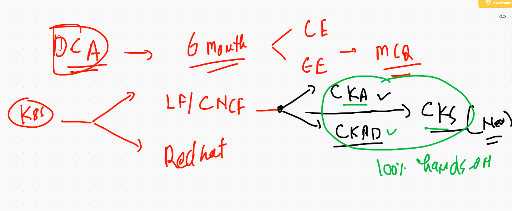

# Certifications 




## POD deletion 

```
❯ kubectl   delete pods --all
pod "ashu-pod-1" deleted
pod "ashupod2" deleted
pod "dhavalpod1" deleted
pod "dhavalpod2" deleted
pod "rajeev-pod-1" deleted
pod "rajeevpod" deleted
pod "rajupod1" deleted
pod "rajupod3" deleted
```

## creation of PODs 

```
❯ kubectl  get po
NAME           READY   STATUS    RESTARTS   AGE
ashu-pod-1     1/1     Running   0          47s
rajupod1       1/1     Running   0          14s
yogesh-pod-1   1/1     Running   0          13s
❯ kubectl  get po ashu-pod-1  -o wide
NAME         READY   STATUS    RESTARTS   AGE   IP               NODE          NOMINATED NODE   READINESS GATES
ashu-pod-1   1/1     Running   0          57s   192.168.27.211   k8s-minion2   <none>           <none>
❯ kubectl  get po ashu-pod-1  --show-labels
NAME         READY   STATUS    RESTARTS   AGE   LABELS
ashu-pod-1   1/1     Running   0          66s   x=helloashu
❯ kubectl  get po   --show-labels
NAME           READY   STATUS              RESTARTS   AGE   LABELS
ashu-pod-1     1/1     Running             0          88s   x=helloashu
rajeev-pod-1   0/1     ContainerCreating   0          2s    x=hellorajeev
rajupod1       1/1     Running             0          55s   x=raju_l1
yogesh-pod-1   1/1     Running             0          54s   x=helloyogesh


```


## listing out all api resources that k8s support

```
❯ kubectl  api-resources
NAME                              SHORTNAMES   APIVERSION                             NAMESPACED   KIND
bindings                                       v1                                     true         Binding
componentstatuses                 cs           v1                                     false        ComponentStatus
configmaps                        cm           v1                                     true         ConfigMap
endpoints                         ep           v1                                     true         Endpoints
events                            ev           v1                                     true         Event
limitranges                       limits       v1                                     true         LimitRange
namespaces                        ns           v1                                     false        Namespace
nodes                             no           v1                                     false        Node
persistentvolumeclaims            pvc          v1                                     true         PersistentVolumeClaim
persistentvolumes                 pv           v1                                     false        PersistentVolume
pods                              po           v1                                     true         Pod
podtemplates                                   v1                      

```


## POD more info 

```
❯ kubectl  describe pod ashu-pod-1
Name:         ashu-pod-1
Namespace:    default
Priority:     0
Node:         k8s-minion2/172.31.81.216
Start Time:   Thu, 21 Jan 2021 10:01:22 +0530
Labels:       x=helloashu
Annotations:  cni.projectcalico.org/podIP: 192.168.27.211/32
              cni.projectcalico.org/podIPs: 192.168.27.211/32
Status:       Running
IP:           192.168.27.211
IPs:
  IP:  192.168.27.211
Containers:
  ashuc1:
    Container ID:   docker://9e8dc6546ebb7cab602a1f93d710c908970388ff5c036f0e19aada3330d73acc
    Image:          nginx
    Image ID:       docker-pullable://nginx@sha256:10b8cc432d56da8b61b070f4c7d2543a9ed17c2b23010b43af434fd40e2ca4aa
    Port:           80/TCP
    Host Port:      0/TCP
    State:          Running
      Started:      Thu, 21 Jan 2021 10:01:24 +0530
      
```

## service type in k8s


## Nodeport 


## nodeport creation 

```
❯ kubectl  create  service  nodeport  ashusvc1  --tcp  1234:80  --dry-run=client -o yaml
apiVersion: v1
kind: Service
metadata:
  creationTimestamp: null
  labels:
    app: ashusvc1
  name: ashusvc1
spec:
  ports:
  - name: 1234-80
    port: 1234
    protocol: TCP
    targetPort: 80
  selector:
    app: ashusvc1
  type: NodePort
status:
  loadBalancer: {}
❯ kubectl  create  service  nodeport  ashusvc1  --tcp  1234:80  --dry-run=client -o yaml  >ashusvc1.yaml

```

## service deployment 

```
❯ kubectl apply -f ashusvc1.yaml
service/ashusvc1 created
❯ kubectl  get  service
NAME         TYPE        CLUSTER-IP       EXTERNAL-IP   PORT(S)          AGE
ashusvc1     NodePort    10.109.119.122   <none>        1234:32376/TCP   10s
kubernetes   ClusterIP   10.96.0.1        <none>        443/TCP          19h
❯ kubectl  get  service
NAME            TYPE        CLUSTER-IP       EXTERNAL-IP   PORT(S)          AGE
ashusvc1        NodePort    10.109.119.122   <none>        1234:32376/TCP   47s
dhpsvc1         NodePort    10.111.174.162   <none>        4567:32662/TCP   2s
kubernetes      ClusterIP   10.96.0.1        <none>        443/TCP          19h
rajeevc1        NodePort    10.102.64.6      <none>        1235:30974/TCP   21s
santhoshisvc1   NodePort    10.110.169.29    <none>        1261:30971/TCP   22s
seshasvc1       NodePort    10.101.177.128   <none>        2345:31682/TCP   6s
yogeshsvc1      NodePort    10.104.99.50     <none>        9876:31330/TCP   32s

```

## service ip 

```
❯ kubectl get svc -o wide
NAME            TYPE        CLUSTER-IP       EXTERNAL-IP   PORT(S)          AGE   SELECTOR
ashusvc1        NodePort    10.109.119.122   <none>        1234:32376/TCP   22m   x=helloashu
dhpsvc1         NodePort    10.111.174.162   <none>        4567:32662/TCP   22m   x=helloadhp
kubernetes      ClusterIP   10.96.0.1        <none>        443/TCP          20h   <none>
rajeevc1        NodePort    10.102.64.6      <none>        1235:30974/TCP   22m   x=hellorajeev
raju-svc1       NodePort    10.106.203.183   <none>        1234:30007/TCP   19m   x=raju_l1
santhoshisvc1   NodePort    10.110.169.29    <none>        1261:30971/TCP   22m   x=hellosanthoshi
satsvc1         NodePort    10.98.115.45     <none>        1234:32697/TCP   21m   x=satlab1


```

## Deleting pod and services

```
❯ kubectl delete pods --all
pod "ashu-pod-1" deleted
pod "dhp-pod-1" deleted
pod "rajeev-pod-1" deleted
pod "rajupod1" deleted
pod "santhoshi-pod-1" deleted
pod "sat-1" deleted
pod "sat-2" deleted
pod "saurav-pod-1" deleted
pod "seshapod1" deleted
pod "skm-pod-3" deleted
pod "sony-pod-1" deleted
pod "yogesh-pod-1" deleted
❯ kubectl delete svc --all
service "ashusvc1" deleted
service "dhpsvc1" deleted
service "kubernetes" deleted
service "rajeevc1" deleted
service "raju-svc1" deleted
service "santhoshisvc1" deleted
service "satsvc1" deleted
service "sauravsvc1" deleted
service "seshasvc1" deleted
service "sonyvc1" deleted
service "yogeshsvc1" deleted

```

# Replication controller

```
apiVersion: v1
kind: ReplicationController
metadata:
 name: ashu-rc-1
 labels:  # label of RC 
  x: helloashurc
spec:
 replicas: 1 #  need one Pod
 template: # use this template to create no of pod replica
  metadata:
   labels:
    x: helloashurcc  # label of all the POD created by RC 
  spec:
   containers:
  - image: dockerashu/ashujsp:v1 
    name: ashuc1 
    ports:
    - containerPort: 80 # application port
    
 ```
 
 
 ## deployment of RC
 
 ```
 ❯ kubectl apply -f ashurc1.yaml
replicationcontroller/ashu-rc-1 created
❯ 
❯ kubectl  get   replicationcontroller
NAME        DESIRED   CURRENT   READY   AGE
ashu-rc-1   1         1         0       10s
sat-rc-1    1         1         0       14s
❯ 
❯ kubectl  get    rc
NAME        DESIRED   CURRENT   READY   AGE
ashu-rc-1   1         1         1       16s
sat-rc-1    1         1         1       20s

```

## replacing any yaml api resource

```
❯ kubectl replace -f ashurc1.yaml --force
replicationcontroller "ashu-rc-1" deleted
replicationcontroller/ashu-rc-1 replaced
❯ kubectl replace -f ashusvc1.yaml --force
service "ashusvc1" deleted
service/ashusvc1 replaced

```

## Expose RC to create service with matched label of POD

```
❯ kubectl  expose  rc  ashu-rc-1   --type NodePort --port 1234 --target-port 8080 --name ashusvc2
service/ashusvc2 exposed
❯ kubectl  get  svc
NAME            TYPE        CLUSTER-IP       EXTERNAL-IP   PORT(S)          AGE
ashusvc2        NodePort    10.111.38.236    <none>        1234:30101/TCP   23s

```

## scaling pod using RC 

```
❯ kubectl  scale  rc  ashu-rc-1  --replicas=5
replicationcontroller/ashu-rc-1 scaled
❯ kubectl  get  rc  ashu-rc-1
NAME        DESIRED   CURRENT   READY   AGE
ashu-rc-1   5         5         5       22m
❯ kubectl  scale  rc  ashu-rc-1  --replicas=2
replicationcontroller/ashu-rc-1 scaled
❯ kubectl  get  rc  ashu-rc-1
NAME        DESIRED   CURRENT   READY   AGE
ashu-rc-1   2         2         2       22m

```

## history 

```
 4072  kubectl  get po --show-labels
 4073  kubectl  get po ashu-rc-1-l426k   --show-labels
❯ kubectl delete  rc  ashu-rc-1
replicationcontroller "ashu-rc-1" deleted
❯ kubectl delete all --all

```

## introduction to deployment api resource in k8s


## reality of deployment 


## creating deployemnt 

```
❯ kubectl create  deployment  ashu-depweb --image=dockerashu/jan2021:webv1 --dry-run=client -o yaml
apiVersion: apps/v1
kind: Deployment
metadata:
  creationTimestamp: null
  labels:
    app: ashu-depweb
  name: ashu-depweb
spec:
  replicas: 1
  selector:
    matchLabels:
      app: ashu-depweb
  strategy: {}
  template:
    metadata:
      creationTimestamp: null
      labels:
        app: ashu-depweb
    spec:
      containers:
      - image: dockerashu/jan2021:webv1
        name: jan2021
        resources: {}
status: {}
❯ kubectl create  deployment  ashu-depweb --image=dockerashu/jan2021:webv1 --dry-run=client -o yaml >ashudep.yml


```


## checking deployment 

```
❯ kubectl get deploy
NAME               READY   UP-TO-DATE   AVAILABLE   AGE
ashu-depweb        1/1     1            1           32s
dhp-webapp         0/1     1            0           1s
rajeev-deployweb   1/1     1            1           6s
rajeev-depweb      1/1     1            1           3m9s
raju-depweb        1/1     1            1           81s
santhoshi-depweb   1/1     1            1           2m8s
sat-depweb         1/1     1            1           5s
skm-depweb         1/1     1            1           76s
sony-depweb        1/1     1            1           18s
❯ kubectl  get  rs
NAME                          DESIRED   CURRENT   READY   AGE
ashu-depweb-54f9bb9fc4        1         1         1       36s
dhp-webapp-767d45d94c         1         1         1       5s
rajeev-deployweb-bd7f777c6    1         1         1       10s
rajeev-depweb-6549c8ccd6      1         1         1       3m13s
raju-depweb-79f84968bc        1         1         1       85s
santhoshi-depweb-8548c7964b   1         1         1       2m12s
sat-depweb-ddc958b7f          1         1         1       9s
skm-depweb-6f8bcb8b8          1         1         1       80s
sony-depweb-67bc9fb758        1         1         1       22s
❯ kubectl  get  po
NAME                                READY   STATUS    RESTARTS   AGE
ashu-depweb-54f9bb9fc4-vfnqs        1/1     Running   0          41s
dhp-webapp-767d45d94c-t7t8m         1/1     Running   0          10s
rajeev-deployweb-bd7f777c6-7xb2p    1/1     Running   0          15s
rajeev-depweb-6549c8ccd6-dwctl      1/1     Running   0          3m18s
raju-depweb-79f84968bc-nf8d9        1/1     Running   0          90s
santhoshi-depweb-8548c7964b-85dp4   1/1     Running   0          2m17s
sat-depweb-ddc958b7f-bg8w8          1/1     Running   0          14s
skm-depweb-6f8bcb8b8-fjrp8          1/1     Running   0          85s
sony-depweb-67bc9fb758-2fptx        1/1     Running   0          27s

```


# Deployment 

```
❯ kubectl apply -f ashudep.yml
deployment.apps/ashu-depweb created
❯ kubectl  get  deploy
NAME          READY   UP-TO-DATE   AVAILABLE   AGE
ashu-depweb   1/1     1            1           5s
dhp-webapp    1/1     1            1           67s
❯ kubectl expose deployment ashu-depweb  --type NodePort --port 1234 --target-port 80 --name ashusvc5
service/ashusvc5 exposed
❯ kubectl  get  svc
NAME           TYPE        CLUSTER-IP      EXTERNAL-IP   PORT(S)          AGE
ashusvc5       NodePort    10.97.188.68    <none>        1234:30701/TCP   4s
dhpsvc3-dep1   NodePort    10.104.223.82   <none>        2345:31896/TCP   68s
kubernetes     ClusterIP   10.96.0.1       <none>        443/TCP          6m40s
yogeshsvc1     NodePort    10.106.247.65   <none>        9876:30007/TCP   24s
❯ kubectl  get  rs
NAME                         DESIRED   CURRENT   READY   AGE
ashu-depweb-54f9bb9fc4       1         1         1       2m11s
dhp-webapp-767d45d94c        1         1         1       3m13s
rajeev-deployweb-bd7f777c6   1         1         1       113s
saurav-debweb-6b99859ff7     1         1         1       113s

```
## checking revesion number 

```
❯ kubectl  describe deployment  ashu-depweb
Name:                   ashu-depweb
Namespace:              default
CreationTimestamp:      Thu, 21 Jan 2021 14:33:02 +0530
Labels:                 app=ashu-depweb
Annotations:            deployment.kubernetes.io/revision: 1
Selector:               app=ashu-depweb
Replicas:               1 desired | 1 updated | 1 total | 1 available | 0 unavailable
StrategyType:           RollingUpdate
MinReadySeconds:        0
RollingUpdateStrategy:  25% max unavailable, 25% max surge
Pod Template:
  Labels:  app=ashu-depweb
  Containers:


```

## scaling deployment 

```
❯ kubectl  scale deploy  ashu-depweb --replicas=3
deployment.apps/ashu-depweb scaled
❯ kubectl  get deploy
NAME               READY   UP-TO-DATE   AVAILABLE   AGE
ashu-depweb        3/3     3            3           11m

```

## updating application version via image 

```
kubectl  set image  deployment  ashu-depweb jan2021=dockerashu/jan2021:webv2 

```

## checking version history 

```
❯ kubectl  rollout history deployment ashu-depweb
deployment.apps/ashu-depweb 
REVISION  CHANGE-CAUSE
1         <none>
2         <none>

❯ kubectl  describe deployment  ashu-depweb
Name:                   ashu-depweb
Namespace:              default
CreationTimestamp:      Thu, 21 Jan 2021 14:33:02 +0530
Labels:                 app=ashu-depweb
Annotations:            deployment.kubernetes.io/revision: 2
Selector:               app=ashu-depweb
Replicas:               3 desired | 3 updated | 3 total | 3 available | 0 unavailable
StrategyType:           RollingUpdate
MinReadySeconds:        0
RollingUpdateStrategy:  25% max unavailable, 25% max surge

```

## rolling back 

```
❯ kubectl rollout  undo  deployment  ashu-depweb  --to-revision=1
deployment.apps/ashu-depweb rolled back

```


## deployment history 

```
 4129* kubectl  describe deployment  ashu-depweb 
 4130* kubectl  set image  deployment  ashu-depweb jan2021=dockerashu/jan2021:webv2
 4131* history
 4132* kubectl  describe deployment  ashu-depweb 
 4133* history
 4134* kubectl  rollout history deployment ashu-depweb 
 4135* kubectl  describe deployment  ashu-depweb 
 4136* history
 4137  docker build  -t  dockerashu/jan2021:webv3  https://github.com/redashu/beginner-html-site-styled.git\#gh-pages
 4138  docker push dockerashu/jan2021:webv3
 4139  history
 4140  kubectl  set image  deployment  ashu-depweb jan2021=dockerashu/jan2021:webv3
 4141  kubectl  rollout history deployment ashu-depweb 
 4142  kubectl  describe deployment  ashu-depweb 
❯ kubectl rollout  undo  deployment  ashu-depweb  --to-revesion=1

```
# PUshing image to ACR 

```
4157  docker pull alpine 
 4158  docker  images
 4159  docker  tag  alpine:latest    ashutoshhoracle.azurecr.io/alpine:v1
 4160  docker  images
 4161  docker  login  ashutoshhoracle.azurecr.io 
 4162  docker  push  ashutoshhoracle.azurecr.io/alpine:v1
 
 ```
 
 # secret in k8s
 
 
 
 ## creating secret of docker registry type 
 
 ```
 kubectl  create  secret  docker-registry  ashusec1  --docker-server=ashutoshhoracle.azurecr.io --docker-username=ashutoshhoracle    --docker-password=456gfhgHIvugeQ
 
 ```
 
 ## POd more commands
 
 ```
 4188  kubectl  logs  ashudep2-587474c959-thszw  
 4189  kubectl  logs  ashudep2-587474c959-thszw   -f
❯ kubectl exec -it ashudep2-587474c959-thszw  sh
kubectl exec [POD] [COMMAND] is DEPRECATED and will be removed in a future version. Use kubectl exec [POD] -- [COMMAND] instead.
/ # 
/ # 
/ # 
/ # cat  /etc/os-release 
NAME="Alpine Linux"
ID=alpine
VERSION_ID=3.13.0
PRETTY_NAME="Alpine Linux v3.13"
HOME_URL="https://alpinelinux.org/"
BUG_REPORT_URL="https://bugs.alpinelinux.org/"
/ # exit

```

###

```
❯ kubectl exec -it ashudep2-587474c959-thszw --  sh
/ # 

```


# top 200 kubectl commands

```
3948  kubectl apply  -f  ashupod1.yaml --dry-run=client  
 3949  kubectl apply  -f  ashupod1.yaml 
 3950  kubectl  get  pods
 3951  kubectl  get  nodes
 3952  kubectl  get   pods  ashu-pod-1  -o wide 
 3953  kubectl  get   pods  -o wide 
 3954  history
 3955  kubectl  get   pods  
 3956  kubectl  get   pods  ashu-pod-1  -o wide 
 3957  kubectl  describe  pods  ashu-pod-1  
 3958  kubectl  get   pods  
 3959  kubectl  describe  pods  pod1    
 3960  history
 3961  kubectl  get   pods  
 3962  kubectl delete pod pod1 
 3963  kubectl  get   pods  -o wide 
 3964  # docker run  
 3965  kubectl  run  ashupod2  --image=nginx --port=80 --dry-run=client -o yaml
 3966  kubectl  run  ashupod2  --image=nginx --port=80 --dry-run=client -o json 
 3967  kubectl  run  ashupod2  --image=nginx --port=80 --dry-run=client -o yaml   >ashupod2.yaml
 3968  ls
 3969  cat  ashupod2.yaml
 3970  kubectl apply -f ashupod2.yaml
 3971  kubectl  get po 
 3972  history
 3973  kubectl  get po 
 3974  kubectl  get no
 3975  kubectl get po ashupod2 -o wide
 3976  kubectl  port-farword  ashupod2  1123:80
 3977  kubectl  port-forward  ashupod2  1123:80
 3978  Connect-AzAccount
 3979  brew update && brew install azure-cli
 3980  brew update
 3981  brew install azure-cli 
 3982  brew upgrade azure-cli 
 3983  Connect-AzAccount
 3984  onnect-AzAccount
 3985  Connect-AzAccount
 3986  az login 
 3987  clear
 3988  az vm availability-set list
 3989  kubectl  get  nodes
 3990  kubectl   get  pods 
 3991  kubectl   delete pods --all
 3992  kubectl  get  po 
 3993  kubectl  get  no
 3994  cd  Desktop/mypods
 3995  ls
 3996  kubectl apply -f  ashupod1.yaml 
 3997  kubectl  get  po 
 3998  kubectl  get  po  ashu-pod-1 -o wide
 3999  kubectl  get po 
 4000  kubectl  get po ashu-pod-1  -o wide 
 4001  kubectl  get po ashu-pod-1  --show-labels
 4002  kubectl  get po   --show-labels
 4003  history
 4004  kubectl  get po   --show-labels
 4005  kubectl  api-resources
 4006  kubectl  get po   --show-labels
 4007  kubectl  get pods   --show-labels
 4008  kubectl  get pods   --show-labels -o wide 
 4009  history
 4010  kubectl  describe pod ashu-pod-1
 4011  history
 4012  kubectl  create  service  nodeport  ashusvc1  --tcp  1234:80  --dry-run=client -o yaml 
 4013  kubectl  create  service  nodeport  ashusvc1  --tcp  1234:80  --dry-run=client -o yaml  >ashusvc1.yaml
 4014  kubectl  api-resources 
 4015  kubectl  api-resources   | wc -l
 4016  kubectl apply -f ashusvc1.yaml 
 4017  kubectl  get  service 
 4018  cd
 4019  ssh -i Downloads/macdocker.pem ec2-user@3.91.146.62
 4020  kubectl apply -f ashusvc1.yaml
 4021  kubectl get svc
 4022  kubectl apply -f ashusvc1.yaml
 4023  kubectl get svc -o wide 
 4024  kubectl get svc ashusvc1  -o yaml 
 4025  kubectl get pod ashu-pod-1  -o yaml 
 4026  history
 4027  kubectl delete pods --all
 4028  kubectl delete svc --all
 4029  kubectl apply -f ashurc1.yaml 
 4030  kubectl  get   replicationcontroller
 4031  kubectl  get    rc
 4032  kubectl  get  po 
 4033  kubectl  get  po -o wide 
 4034  kubectl  get    rc
 4035  kubectl  get  po 
 4036  kubectl delete pod ashu-rc-1-rlxcp  
 4037  kubectl  get  po 
 4038  kubectl  get  po -o wide
 4039  history
 4040  kubectl apply -f ashusvc1.yaml 
 4041  kubectl get  svc
 4042  kubectl  get  po --show-labels
 4043  kubectl replace -f ashurc1.yaml --force 
 4044  kubectl replace -f ashusvc1.yaml --force 
 4045  kubectl get rc 
 4046  kubectl  get  svc 
 4047  history
 4048  kubectl  get  svc 
 4049  kubectl  delete  svc ashusvc1
 4050  kubectl  get  rc
 4051  kubectl  expose  rc  ashu-rc-1   --type NodePort --port 1234 --target-port 8080 --name ashusvc2 
 4052  kubectl  get  svc 
 4053  history
 4054  kubectl  expose  rc  ashu-rc-1   --type NodePort --port 1234 --target-port 8080 --name ashusvc2 --dry-run=client -o yaml 
 4055  kubectl get svc  ashusvc2  -o yaml 
 4056  history
 4057  kubectl  get  po
 4058  kubectl  describe pod ashu-rc-1-l426k  
 4059  history
 4060  kubectl apply -f ashurc1.yaml
 4061  kubectl  get  rc 
 4062  kubectl  get  po 
 4063  kubectl  get  po -o wide 
 4064  history
 4065  kubectl  get  rc 
 4066  kubectl  scale  rc  ashu-rc-1  --replicas=5
 4067  kubectl  get  rc  ashu-rc-1
 4068  kubectl  scale  rc  ashu-rc-1  --replicas=2
 4069  kubectl  get  rc  ashu-rc-1
 4070  kubectl  get po
 4071  history
 4072  kubectl  get po --show-labels
 4073  kubectl  get po ashu-rc-1-l426k   --show-labels
 4074  history
 4075  kubectl delete  rc  ashu-rc-1
 4076  kubectl delete all --all
 4077  history
 4078  kubectl get  all 
 4079  docker build  -t  dockerashu/jan2021:webv1  https://github.com/redashu/beginner-html-site-styled.git 
 4080  docker build  -t  dockerashu/jan2021:webv1  https://github.com/redashu/beginner-html-site-styled.git\#gh-pages 
 4081  docker push dockerashu/jan2021:webv1
 4082  kubectl create  deployment  ashu-depweb --image=dockerashu/jan2021:webv1 --dry-run=client -o yaml 
 4083  kubectl create  deployment  ashu-depweb --image=dockerashu/jan2021:webv1 --dry-run=client -o yaml >ashudep.yml
 4084  history
 4085  kubectl apply -f  ashudep.yml
 4086  kubectl get deployments
 4087  kubectl get deployment
 4088  kubectl get deploy
 4089  kubectl  get  rs
 4090  kubectl  get  po
 4091  history
 4092  kubectl get deploy
 4093  kubectl expose deployment ashu-depweb --type NodePort --port 1234 --target-port 80 --name ashusvc3 
 4094  kubectl get svc 
 4095  history
 4096  kubectl explain  pod
 4097  kubectl explain  pod.kind
 4098  kubectl explain  pod.spec 
 4099  kubectl explain  pod.spec.containers
 4100  kubectl delete all --all
 4101  kubectl  get po 
 4102  kubectl  get po  -w
 4103  kubectl  get rc
 4104  kubectl  get  rs
 4105  kubectl  get  po
 4106  cd Desktop/mypods
 4107  ls
 4108  kubectl apply -f ashudep.yml
 4109  kubectl  get  deploy
 4110  kubectl expose deployment ashu-depweb  --type NodePort --port 1234 --target-port 80 --name ashusvc5 
 4111  kubectl  get  svc 
 4112  kubectl  get  rs 
 4113  history
 4114  kubectl  get deploy 
 4115  kubectl  get  svc 
 4116  kubectl  describe deployment  ashu-depweb  
 4117  kubectl  get deploy 
 4118  kubectl  get rs
 4119  kubectl  get deploy 
 4120  kubectl  scale deploy  ashu-depweb --replicas=3
 4121  kubectl  get deploy 
 4122  history
 4123  kubectl  get deploy 
 4124  kubectl  get po 
 4125  history
 4126  history|   grep -i docker
 4127  docker push dockerashu/jan2021:webv2
 4128  history
 4129  kubectl  describe deployment  ashu-depweb 
 4130  kubectl  set image  deployment  ashu-depweb jan2021=dockerashu/jan2021:webv2
 4131  history
 4132  kubectl  describe deployment  ashu-depweb 
 4133  history
 4134  kubectl  rollout history deployment ashu-depweb 
 4135  kubectl  describe deployment  ashu-depweb 
 4136  history
 4137  docker build  -t  dockerashu/jan2021:webv3  https://github.com/redashu/beginner-html-site-styled.git\#gh-pages
 4138  docker push dockerashu/jan2021:webv3
 4139  history
 4140  kubectl  set image  deployment  ashu-depweb jan2021=dockerashu/jan2021:webv3
 4141  kubectl  rollout history deployment ashu-depweb 
 4142  kubectl  describe deployment  ashu-depweb 
 4143  history
 4144  kubectl rollout  undo  deployment  ashu-depweb  --to-revesion=1
 4145  kubectl rollout  undo  deployment  ashu-depweb  --to-revision=1
 4146  ssh -i Downloads/macdocker.pem ec2-user@
 4147  ssh -i Downloads/macdocker.pem ec2-user@54.161.225.68
 4148  ## use this link https://github.com/mdn/beginner-html-site-styled 
 4149  ## create dockerfile and build  httpd OR nginx based docker image 
 4150  ## push it to dockerhub 
 4151  ## create a deployment using that image with 2 replica of pod 
 4152  ## create service to access that deployment 
 4153  kubectl  get deploy
 4154  kubectl  get svc 
 4155  history
 4156  docker  images
 4157  docker pull alpine 
 4158  docker  images
 4159  docker  tag  alpine:latest    ashutoshhoracle.azurecr.io/alpine:v1
 4160  docker  images
 4161  docker  login  ashutoshhoracle.azurecr.io 
 4162  docker  push  ashutoshhoracle.azurecr.io/alpine:v1
 4163  history
 4164  docker  logout   ashutoshhoracle.azurecr.io 
 4165  cd  Desktop/mypods
 4166  kubectl  create deployment  ashudep2  --image=ashutoshhoracle.azurecr.io/alpine:v1 --dry-run=client -o yaml >private.yml
 4167  ls
 4168  kubectl get deploy 
 4169  kubectl delete all --all
 4170  ls
 4171  kubectl apply -f  private.yml
 4172  kubectl get  deploy 
 4173  kubectl get  po
 4174  kubectl describe   deploy  ashudep2 
 4175  kubectl describe   pod  ashudep2-7bbb4df4f5-4gwh7
 4176  history
 4177  kubectl  create  secret  
 4178  kubectl  create  secret  docker-registry  ashusec1  --docker-server=ashutoshhoracle.azurecr.io --docker-username=ashutoshhoracle    --docker-password=HIvugeQW6iedXRw79y8Iv9O9sJwR+Pia  
 4179  kubectl  get  secret 
 4180  history
 4181  kubectl  get  secret 
 4182  kubectl replace -f  private.yml --force 
 4183  kubectl explain pod.spec  |   grep -i imagepu
 4184  kubectl replace -f  private.yml --force 
 4185  kubectl  get  po 
 4186  kubectl replace -f  private.yml --force 
 4187  kubectl  get  po 
 4188  kubectl  logs  ashudep2-587474c959-thszw  
 4189  kubectl  logs  ashudep2-587474c959-thszw   -f
 4190  history
 4191  kubectl exec -it ashudep2-587474c959-thszw  sh 
 4192  kubectl exec -it ashudep2-587474c959-thszw --  sh 
❯ history  |   grep -i kubectl  |   tail -200
 3792  kubectl logs sauwebapp-6cff4444c5-rkhq9   -n saurav-space
 3793  kubectl  get svc -n saurav-space
 3794  kubectl  config get-contexts 
 3802  kubectl  config get-contexts 
 3803  kubectl  get  no
 3804  kubectl  config 
 3805  kubectl  config get-contexts 
 3806  kubectl config use-context  kubernetes-admin 
 3807  kubectl config use-context  kubernetes-admin@kubernetes 
 3808  kubectl get no
 3809  kubectl config use-context  arn:aws:eks:ap-south-1:061112302981:cluster/ciscojan2021 
 3810  kubectl get no
 3811  kubectl get ns
 3812  kubectl create deployment ashuwebapp --image=nginx 
 3813  kubectl get deploy 
 3814  kubectl expose deployment ashuwebapp --type LoadBalancer --port 1234 --target-port 80 
 3815  kubectl get  svc 
 3817  kubectl delete svc ashuwebapp 
 3818  kubectl get  svc 
 3822  kubectl  get  po 
 3909  curl -LO "https://dl.k8s.io/release/$(curl -L -s https://dl.k8s.io/release/stable.txt)/bin/darwin/amd64/kubectl"
 3910  chmod +x ./kubectl
 3911  sudo mv ./kubectl /usr/local/bin/kubectl
 3912  kubectl version --client
 3913  kubectl  version  --client 
 3917  kubectl   version   --kubeconfig  admin.conf
 3918  kubectl   get  nodes   --kubeconfig  admin.conf
 3919  kubectl   get  nodes  
 3920  kubectl   get  nodes   --kubeconfig  admin.conf
 3934  kubectl   get  nodes
 3935  kubectl   version  
 3938  kubectl   get  no
 3939  kubectl  cluster-info 
 3948  kubectl apply  -f  ashupod1.yaml --dry-run=client  
 3949  kubectl apply  -f  ashupod1.yaml 
 3950  kubectl  get  pods
 3951  kubectl  get  nodes
 3952  kubectl  get   pods  ashu-pod-1  -o wide 
 3953  kubectl  get   pods  -o wide 
 3955  kubectl  get   pods  
 3956  kubectl  get   pods  ashu-pod-1  -o wide 
 3957  kubectl  describe  pods  ashu-pod-1  
 3958  kubectl  get   pods  
 3959  kubectl  describe  pods  pod1    
 3961  kubectl  get   pods  
 3962  kubectl delete pod pod1 
 3963  kubectl  get   pods  -o wide 
 3965  kubectl  run  ashupod2  --image=nginx --port=80 --dry-run=client -o yaml
 3966  kubectl  run  ashupod2  --image=nginx --port=80 --dry-run=client -o json 
 3967  kubectl  run  ashupod2  --image=nginx --port=80 --dry-run=client -o yaml   >ashupod2.yaml
 3970  kubectl apply -f ashupod2.yaml
 3971  kubectl  get po 
 3973  kubectl  get po 
 3974  kubectl  get no
 3975  kubectl get po ashupod2 -o wide
 3976  kubectl  port-farword  ashupod2  1123:80
 3977  kubectl  port-forward  ashupod2  1123:80
 3989  kubectl  get  nodes
 3990  kubectl   get  pods 
 3991  kubectl   delete pods --all
 3992  kubectl  get  po 
 3993  kubectl  get  no
 3996  kubectl apply -f  ashupod1.yaml 
 3997  kubectl  get  po 
 3998  kubectl  get  po  ashu-pod-1 -o wide
 3999  kubectl  get po 
 4000  kubectl  get po ashu-pod-1  -o wide 
 4001  kubectl  get po ashu-pod-1  --show-labels
 4002  kubectl  get po   --show-labels
 4004  kubectl  get po   --show-labels
 4005  kubectl  api-resources
 4006  kubectl  get po   --show-labels
 4007  kubectl  get pods   --show-labels
 4008  kubectl  get pods   --show-labels -o wide 
 4010  kubectl  describe pod ashu-pod-1
 4012  kubectl  create  service  nodeport  ashusvc1  --tcp  1234:80  --dry-run=client -o yaml 
 4013  kubectl  create  service  nodeport  ashusvc1  --tcp  1234:80  --dry-run=client -o yaml  >ashusvc1.yaml
 4014  kubectl  api-resources 
 4015  kubectl  api-resources   | wc -l
 4016  kubectl apply -f ashusvc1.yaml 
 4017  kubectl  get  service 
 4020  kubectl apply -f ashusvc1.yaml
 4021  kubectl get svc
 4022  kubectl apply -f ashusvc1.yaml
 4023  kubectl get svc -o wide 
 4024  kubectl get svc ashusvc1  -o yaml 
 4025  kubectl get pod ashu-pod-1  -o yaml 
 4027  kubectl delete pods --all
 4028  kubectl delete svc --all
 4029  kubectl apply -f ashurc1.yaml 
 4030  kubectl  get   replicationcontroller
 4031  kubectl  get    rc
 4032  kubectl  get  po 
 4033  kubectl  get  po -o wide 
 4034  kubectl  get    rc
 4035  kubectl  get  po 
 4036  kubectl delete pod ashu-rc-1-rlxcp  
 4037  kubectl  get  po 
 4038  kubectl  get  po -o wide
 4040  kubectl apply -f ashusvc1.yaml 
 4041  kubectl get  svc
 4042  kubectl  get  po --show-labels
 4043  kubectl replace -f ashurc1.yaml --force 
 4044  kubectl replace -f ashusvc1.yaml --force 
 4045  kubectl get rc 
 4046  kubectl  get  svc 
 4048  kubectl  get  svc 
 4049  kubectl  delete  svc ashusvc1
 4050  kubectl  get  rc
 4051  kubectl  expose  rc  ashu-rc-1   --type NodePort --port 1234 --target-port 8080 --name ashusvc2 
 4052  kubectl  get  svc 
 4054  kubectl  expose  rc  ashu-rc-1   --type NodePort --port 1234 --target-port 8080 --name ashusvc2 --dry-run=client -o yaml 
 4055  kubectl get svc  ashusvc2  -o yaml 
 4057  kubectl  get  po
 4058  kubectl  describe pod ashu-rc-1-l426k  
 4060  kubectl apply -f ashurc1.yaml
 4061  kubectl  get  rc 
 4062  kubectl  get  po 
 4063  kubectl  get  po -o wide 
 4065  kubectl  get  rc 
 4066  kubectl  scale  rc  ashu-rc-1  --replicas=5
 4067  kubectl  get  rc  ashu-rc-1
 4068  kubectl  scale  rc  ashu-rc-1  --replicas=2
 4069  kubectl  get  rc  ashu-rc-1
 4070  kubectl  get po
 4072  kubectl  get po --show-labels
 4073  kubectl  get po ashu-rc-1-l426k   --show-labels
 4075  kubectl delete  rc  ashu-rc-1
 4076  kubectl delete all --all
 4078  kubectl get  all 
 4082  kubectl create  deployment  ashu-depweb --image=dockerashu/jan2021:webv1 --dry-run=client -o yaml 
 4083  kubectl create  deployment  ashu-depweb --image=dockerashu/jan2021:webv1 --dry-run=client -o yaml >ashudep.yml
 4085  kubectl apply -f  ashudep.yml
 4086  kubectl get deployments
 4087  kubectl get deployment
 4088  kubectl get deploy
 4089  kubectl  get  rs
 4090  kubectl  get  po
 4092  kubectl get deploy
 4093  kubectl expose deployment ashu-depweb --type NodePort --port 1234 --target-port 80 --name ashusvc3 
 4094  kubectl get svc 
 4096  kubectl explain  pod
 4097  kubectl explain  pod.kind
 4098  kubectl explain  pod.spec 
 4099  kubectl explain  pod.spec.containers
 4100  kubectl delete all --all
 4101  kubectl  get po 
 4102  kubectl  get po  -w
 4103  kubectl  get rc
 4104  kubectl  get  rs
 4105  kubectl  get  po
 4108  kubectl apply -f ashudep.yml
 4109  kubectl  get  deploy
 4110  kubectl expose deployment ashu-depweb  --type NodePort --port 1234 --target-port 80 --name ashusvc5 
 4111  kubectl  get  svc 
 4112  kubectl  get  rs 
 4114  kubectl  get deploy 
 4115  kubectl  get  svc 
 4116  kubectl  describe deployment  ashu-depweb  
 4117  kubectl  get deploy 
 4118  kubectl  get rs
 4119  kubectl  get deploy 
 4120  kubectl  scale deploy  ashu-depweb --replicas=3
 4121  kubectl  get deploy 
 4123  kubectl  get deploy 
 4124  kubectl  get po 
 4129  kubectl  describe deployment  ashu-depweb 
 4130  kubectl  set image  deployment  ashu-depweb jan2021=dockerashu/jan2021:webv2
 4132  kubectl  describe deployment  ashu-depweb 
 4134  kubectl  rollout history deployment ashu-depweb 
 4135  kubectl  describe deployment  ashu-depweb 
 4140  kubectl  set image  deployment  ashu-depweb jan2021=dockerashu/jan2021:webv3
 4141  kubectl  rollout history deployment ashu-depweb 
 4142  kubectl  describe deployment  ashu-depweb 
 4144  kubectl rollout  undo  deployment  ashu-depweb  --to-revesion=1
 4145  kubectl rollout  undo  deployment  ashu-depweb  --to-revision=1
 4153  kubectl  get deploy
 4154  kubectl  get svc 
 4166  kubectl  create deployment  ashudep2  --image=ashutoshhoracle.azurecr.io/alpine:v1 --dry-run=client -o yaml >private.yml
 4168  kubectl get deploy 
 4169  kubectl delete all --all
 4171  kubectl apply -f  private.yml
 4172  kubectl get  deploy 
 4173  kubectl get  po
 4174  kubectl describe   deploy  ashudep2 
 4175  kubectl describe   pod  ashudep2-7bbb4df4f5-4gwh7
 4177  kubectl  create  secret  
 4178  kubectl  create  secret  docker-registry  ashusec1  --docker-server=ashutoshhoracle.azurecr.io --docker-username=ashutoshhoracle    --docker-password=HIvugeQW6iedXRw79y8Iv9O9sJwR+Pia  
 4179  kubectl  get  secret 
 4181  kubectl  get  secret 
 4182  kubectl replace -f  private.yml --force 
 4183  kubectl explain pod.spec  |   grep -i imagepu
 4184  kubectl replace -f  private.yml --force 
 4185  kubectl  get  po 
 4186  kubectl replace -f  private.yml --force 
 4187  kubectl  get  po 
 4188  kubectl  logs  ashudep2-587474c959-thszw  
 4189  kubectl  logs  ashudep2-587474c959-thszw   -f
 4191  kubectl exec -it ashudep2-587474c959-thszw  sh 
 4192  kubectl exec -it ashudep2-587474c959-thszw --  sh 
 
 ```
 

