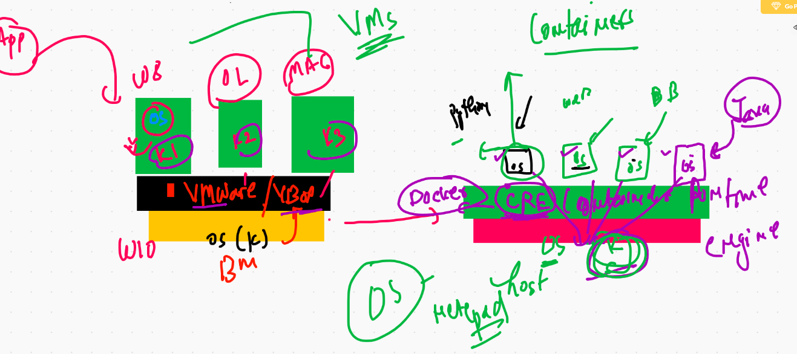

# testing and checking 


## physical server problems 


## Bare metal VS. VMS 


## COntainer intro 




## CRE 


## COntainer support 


## Docker products 


## Docker Desktop explain 


## Docker Desktop links 

### windows 10 

[w10] ('https://hub.docker.com/editions/community/docker-ce-desktop-windows/')

### mac 

[osx] ('https://hub.docker.com/editions/community/docker-ce-desktop-mac/')

## Docker desktop youtube link for windows 10 

[youtube] ('https://www.youtube.com/watch?v=LLXNjtrd4Zk&t=1s')

# Docker installation on LInux VM 

```
 yum  install docker -y
 
 ```
 
 ## starting docker 
 
 ```
 [root@ip-172-31-81-232 ~]# systemctl  start   docker 
[root@ip-172-31-81-232 ~]# systemctl  enable    docker 
Created symlink from /etc/systemd/system/multi-user.target.wants/docker.service to /usr/lib/systemd/system/docker.service.
[root@ip-172-31-81-232 ~]# systemctl  status    docker 
● docker.service - Docker Application Container Engine
   Loaded: loaded (/usr/lib/systemd/system/docker.service; enabled; vendor preset: disabled)
   Active: active (running) since Mon 2021-01-18 06:34:22 UTC; 22s ago
     Docs: https://docs.docker.com
 Main PID: 3798 (dockerd)
   CGroup: /system.slice/docker.service
           └─3798 /usr/bin/dockerd -H fd:// --containerd=/run/containerd/containerd.sock --default-ulimit nofile=1024...

Jan 18 06:34:21 ip-172-31-81-232.ec2.internal dockerd[3798]: time="2021-01-18T06:34:21.294633656Z" level=info msg=...rpc
Jan 18 06:34:21 ip-172-31-81-232.ec2.internal dockerd[3798]: time="2021-01-18T06:34:21.294658871Z" level=info msg=...rpc
Jan 18 06:34:21 ip-172-31-81-232.ec2.internal dockerd[3798]: time="2021-01-18T06:34:21.294675155Z" level=info msg=...rpc
Jan 18 06:34:21 ip-172-31-81-232.ec2.internal dockerd[3798]: time="2021-01-18T06:34:21.355253784Z" level=info msg=...t."
Jan 18 06:34:21 ip-172-31-81-232.ec2.internal dockerd[3798]: 

```


## docker installation check 

```
[ec2-user@ip-172-31-81-232 ~]$ docker  version 
Client:
 Version:           19.03.13-ce
 API version:       1.40
 Go version:        go1.13.15
 Git commit:        4484c46
 Built:             Mon Oct 12 18:51:20 2020
 OS/Arch:           linux/amd64
 Experimental:      false

Server:
 Engine:
  Version:          19.03.13-ce
  API version:      1.40 (minimum version 1.12)
  Go version:       go1.13.15
  Git commit:       4484c46
  Built:            Mon Oct 12 18:51:50 2020
  OS/Arch:          linux/amd64
  Experimental:     false
 containerd:
  Version:          1.4.1
  GitCommit:        c623d1b36f09f8ef6536a057bd658b3aa8632828
 runc:
  Version:          1.0.0-rc92
  GitCommit:        ff819c7e9184c13b7c2607fe6c30ae19
  
  ```
  
  
  ## Image registry Docker hub 
  
  ===
  
  [https://hub.docker.com/search?q=java&type=image]
  
  
  
  ## small arch
  
  [docker hub]
  
  
  
  ## checking and searchimg image from docker client 
  
  ```
    8  docker   images  
    9  docker   search  java 
   10  docker   search  python 
   
   ```
   

