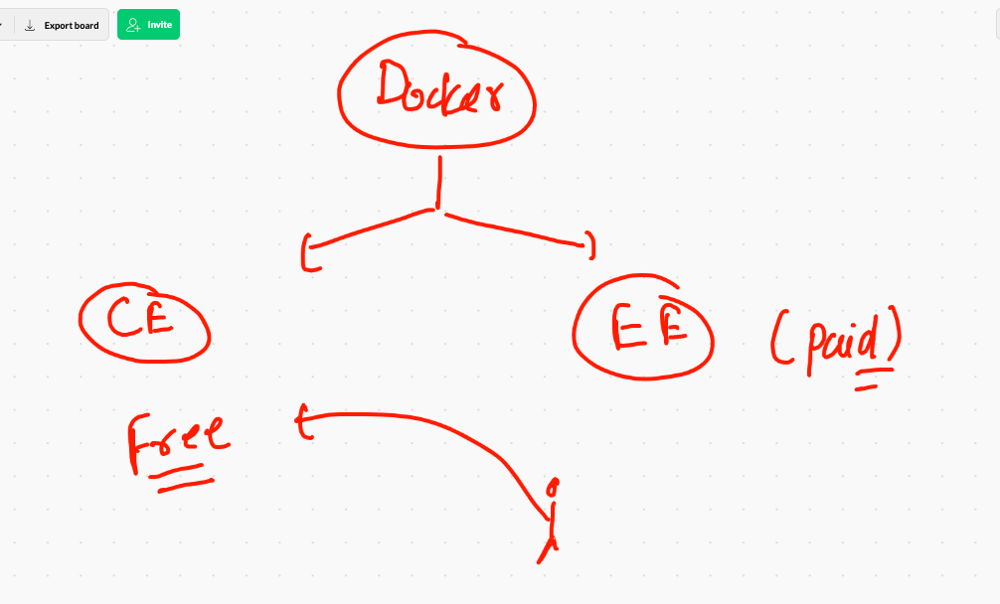
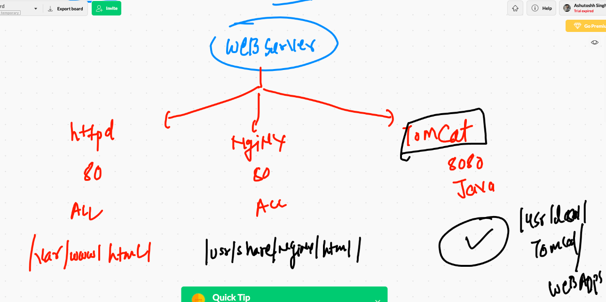

# testing and checking 


## physical server problems 


## Bare metal VS. VMS 


## COntainer intro 


## CRE 


## COntainer support 


## Docker products 




## Docker Desktop explain 


## Docker Desktop links 

### windows 10 

[w10] ('https://hub.docker.com/editions/community/docker-ce-desktop-windows/')

### mac 

[osx] ('https://hub.docker.com/editions/community/docker-ce-desktop-mac/')

## Docker desktop youtube link for windows 10 

[youtube] ('https://www.youtube.com/watch?v=LLXNjtrd4Zk&t=1s')

# Docker installation on LInux VM 

```
 yum  install docker -y
 
 ```
 
 ## starting docker 
 
 ```
 [root@ip-172-31-81-232 ~]# systemctl  start   docker 
[root@ip-172-31-81-232 ~]# systemctl  enable    docker 
Created symlink from /etc/systemd/system/multi-user.target.wants/docker.service to /usr/lib/systemd/system/docker.service.
[root@ip-172-31-81-232 ~]# systemctl  status    docker 
● docker.service - Docker Application Container Engine
   Loaded: loaded (/usr/lib/systemd/system/docker.service; enabled; vendor preset: disabled)
   Active: active (running) since Mon 2021-01-18 06:34:22 UTC; 22s ago
     Docs: https://docs.docker.com
 Main PID: 3798 (dockerd)
   CGroup: /system.slice/docker.service
           └─3798 /usr/bin/dockerd -H fd:// --containerd=/run/containerd/containerd.sock --default-ulimit nofile=1024...

Jan 18 06:34:21 ip-172-31-81-232.ec2.internal dockerd[3798]: time="2021-01-18T06:34:21.294633656Z" level=info msg=...rpc
Jan 18 06:34:21 ip-172-31-81-232.ec2.internal dockerd[3798]: time="2021-01-18T06:34:21.294658871Z" level=info msg=...rpc
Jan 18 06:34:21 ip-172-31-81-232.ec2.internal dockerd[3798]: time="2021-01-18T06:34:21.294675155Z" level=info msg=...rpc
Jan 18 06:34:21 ip-172-31-81-232.ec2.internal dockerd[3798]: time="2021-01-18T06:34:21.355253784Z" level=info msg=...t."
Jan 18 06:34:21 ip-172-31-81-232.ec2.internal dockerd[3798]: 

```


## docker installation check 

```
[ec2-user@ip-172-31-81-232 ~]$ docker  version 
Client:
 Version:           19.03.13-ce
 API version:       1.40
 Go version:        go1.13.15
 Git commit:        4484c46
 Built:             Mon Oct 12 18:51:20 2020
 OS/Arch:           linux/amd64
 Experimental:      false

Server:
 Engine:
  Version:          19.03.13-ce
  API version:      1.40 (minimum version 1.12)
  Go version:       go1.13.15
  Git commit:       4484c46
  Built:            Mon Oct 12 18:51:50 2020
  OS/Arch:          linux/amd64
  Experimental:     false
 containerd:
  Version:          1.4.1
  GitCommit:        c623d1b36f09f8ef6536a057bd658b3aa8632828
 runc:
  Version:          1.0.0-rc92
  GitCommit:        ff819c7e9184c13b7c2607fe6c30ae19
  
  ```
  
  
  ## Image registry Docker hub 
  
  ===
  
  [https://hub.docker.com/search?q=java&type=image]
  
  
  
  ## small arch
  
  [docker hub]
  
  
  
  ## checking and searchimg image from docker client 
  
  ```
    8  docker   images  
    9  docker   search  java 
   10  docker   search  python 
   
   ```
   

## Docker image pull 

```
   16  docker pull oraclelinux:8.3  
   17  docker  images
   18  docker  pull alpine 
   19  docker  pull busybox 
   20  docker  images
   21  history 
[ec2-user@ip-172-31-81-232 ~]$ docker  images
REPOSITORY          TAG                 IMAGE ID            CREATED             SIZE
alpine              latest              7731472c3f2a        3 days ago          5.61MB
oraclelinux         8.3                 f4a1f2c861ca        3 days ago          429MB
busybox             latest              b97242f89c8a        4 days ago          1.23MB
python              latest              da24d18bf4bf        5 days ago          885MB
mysql               latest              d4c3cafb11d5        5 days ago          545MB
dockette/jdk8       latest              13041d54229c        2 years ago         164MB
java                latest              d23bdf5b1b1b        4 years ago         643MB

```

## image storage  

```
Total Memory: 3.794GiB
 Name: ip-172-31-81-232.ec2.internal
 ID: MMCW:XVOE:KQO5:T4YA:DMU5:AAFD:ATW7:W3AJ:HN7H:ZCOU:P5QZ:VCOU
 Docker Root Dir: /var/lib/docker
 Debug Mode: false
 Registry: https://index.docker.io/v1/
 Labels:
 Experimental: false
 Insecure Registries:
  127.0.0.0/8
 Live Restore Enabled: false

[ec2-user@ip-172-31-81-232 ~]$ sudo -i
[root@ip-172-31-81-232 ~]# cd  /var/lib/docker 
[root@ip-172-31-81-232 docker]# ls
builder  buildkit  containers  image  network  overlay2  plugins  runtimes  swarm  tmp  trust  volumes

```


## first container 

```
[ec2-user@ip-172-31-81-232 ~]$ docker  run  --name  ashuc1   alpine:latest   ping google.com 
PING google.com (172.217.12.238): 56 data bytes
64 bytes from 172.217.12.238: seq=0 ttl=109 time=0.829 ms
64 bytes from 172.217.12.238: seq=1 ttl=109 time=0.814 ms
64 bytes from 172.217.12.238: seq=2 ttl=109 time=0.834 ms
64 bytes from 172.217.12.238: seq=3 ttl=109 time=0.823 ms
64 bytes from 172.217.12.238: seq=4 ttl=109 time=0.850 ms
64 bytes from 172.217.12.238: seq=5 ttl=109 time=0.858 ms
64 bytes from 172.217.12.238: seq=6 ttl=109 time=0.821 ms
64 bytes from 172.217.12.238: seq=7 ttl=109 time=0.842 ms
64 bytes from 172.217.12.238: seq=8 ttl=109 time=0.829 ms
64 bytes from 172.217.12.238: seq=9 ttl=109 time=0.820 ms
64 bytes from 172.217.12.238: seq=10 ttl=109 time=0.853 ms
64 bytes from 172.217.12.238: seq=11 ttl=109 time=0.838 ms
64 bytes from 172.217.12.238: seq=12 ttl=109 time=0.802 ms
64 bytes from 172.217.12.238: seq=13 ttl=109 time=0.850 ms
64 bytes from 172.217.12.238: seq=14 ttl=109 time=0.832 ms
64 bytes from 172.217.12.238: seq=15 ttl=109 time=0.837 ms
64 bytes from 172.217.12.238: seq=16 ttl=109 time=0.815 ms
^C
--- google.com ping statistics ---
17 packets transmitted, 17 packets received, 0% packet loss

```

## create a container with parent process in background 

```
[ec2-user@ip-172-31-81-232 ~]$ docker  run  --name  ashuc2  -d    alpine:latest   ping google.com 
cf6315085042bbbc1b39e4b3e04f5baf93af77839f139cc7a6a203ed225dc3d5
[ec2-user@ip-172-31-81-232 ~]$ 
[ec2-user@ip-172-31-81-232 ~]$ 
[ec2-user@ip-172-31-81-232 ~]$ docker   ps
CONTAINER ID        IMAGE               COMMAND             CREATED             STATUS              PORTS               NAMES
cf6315085042        alpine:latest       "ping google.com"   9 seconds ago       Up 7 seconds                            ashuc2

```

## checking outtput of parent process

```
32  docker  run  --name  ashuc2  -d    alpine:latest   ping google.com 
   33  docker   ps
   34  docker  ps
   35  docker  logs   ashuc2  
   36  docker  logs -f    ashuc2 
   
   ```
   
   ## more docker instructions
   
   ```
   [ec2-user@ip-172-31-81-232 ~]$ docker  ps
CONTAINER ID        IMAGE               COMMAND             CREATED              STATUS              PORTS               NAMES
087147e80d27        alpine:latest       "ping google.com"   44 seconds ago       Up 43 seconds                           santhoshic2
343104d68174        alpine              "ping google.com"   About a minute ago   Up About a minute                       sumeet
cf6315085042        alpine:latest       "ping google.com"   3 minutes ago        Up 3 minutes                            ashuc2
[ec2-user@ip-172-31-81-232 ~]$ 
[ec2-user@ip-172-31-81-232 ~]$ 
[ec2-user@ip-172-31-81-232 ~]$ docker  stop  ashuc2  
ashuc2
[ec2-user@ip-172-31-81-232 ~]$ docker  ps
CONTAINER ID        IMAGE               COMMAND             CREATED             STATUS              PORTS               NAMES
087147e80d27        alpine:latest       "ping google.com"   2 minutes ago       Up 2 minutes                            santhoshic2
343104d68174        alpine              "ping google.com"   2 minutes ago       Up 2 minutes                            sumeet
[ec2-user@ip-172-31-81-232 ~]$ docker  start  ashuc2 
ashuc2
[ec2-user@ip-172-31-81-232 ~]$ docker  ps
CONTAINER ID        IMAGE               COMMAND             CREATED             STATUS              PORTS               NAMES
087147e80d27        alpine:latest       "ping google.com"   2 minutes ago       Up 2 minutes                            santhoshic2
343104d68174        alpine              "ping google.com"   2 minutes ago       Up 2 minutes                            sumeet
cf6315085042        alpine:latest       "ping google.com"   4 minutes ago       Up 2 seconds                            ashuc2
[ec2-user@ip-172-31-81-232 ~]$ 
[ec2-user@ip-172-31-81-232 ~]$ 
[ec2-user@ip-172-31-81-232 ~]$ docker  kill  ashuc2 
ashuc2
[ec2-user@ip-172-31-81-232 ~]$ docker  ps
CONTAINER ID        IMAGE               COMMAND             CREATED             STATUS              PORTS               NAMES
087147e80d27        alpine:latest       "ping google.com"   3 minutes ago       Up 3 minutes                            santhoshic2
343104d68174        alpine              "ping google.com"   4 minutes ago       Up 3 minutes                            sumeet
2570f1d2a4d8        alpine:latest       "ping google.com"   6 minutes ago       Up 1 second                             rajualpine
fca6ffc4d98c        alpine:latest       "ping google.com"   7 minutes ago       Up 10 seconds                           rajeevc2
[ec2-user@ip-172-31-81-232 ~]$ docker  start ashuc2
ashuc2
[ec2-user@ip-172-31-81-232 ~]$ docker  ps
CONTAINER ID        IMAGE               COMMAND             CREATED             STATUS              PORTS               NAMES
087147e80d27        alpine:latest       "ping google.com"   3 minutes ago       Up 3 minutes                            santhoshic2
343104d68174        alpine              "ping google.com"   4 minutes ago       Up 4 minutes                            sumeet
cf6315085042        alpine:latest       "ping google.com"   6 minutes ago       Up 2 seconds                            ashuc2
2570f1d2a4d8        alpine:latest       "ping google.com"   6 minutes ago       Up 10 seconds                           rajualpine
fca6ffc4d98c        alpine:latest       "ping google.com"   7 minutes ago       Up 19 seconds                           rajeevc2
[ec2-user@ip-172-31-81-232 ~]$ 


```


## kill and remove container 

```
[ec2-user@ip-172-31-81-232 ~]$ docker kill  $(docker  ps  -q)
ef20960e1b5b
087147e80d27
343104d68174
cf6315085042
[ec2-user@ip-172-31-81-232 ~]$ docker  ps 
CONTAINER ID        IMAGE               COMMAND             CREATED             STATUS              PORTS               NAMES
2570f1d2a4d8        alpine:latest       "ping google.com"   9 minutes ago       Up 1 second                             rajualpine
[ec2-user@ip-172-31-81-232 ~]$ docker rm   $(docker  ps  -qa)
ef20960e1b5b
3585085d3adb
087147e80d27
343104d68174
cf6315085042
d567c9d42129
9a3cb54df6eb
fca6ffc4d98c
58a4c9877b8b
3b2538e0e2ce
Error response from daemon: You cannot remove a running container 2570f1d2a4d88195cf6a92f6a9e697f057786d197d108b13b69167221808d398. Stop the container before attempting removal or force remove

```

## docker summary 


# application containerization 


## Examples for docker images creation


## Python based code for docker image creation 

```
[ec2-user@ip-172-31-81-232 pyapp]$ cat  hello.py 
import  time
import  subprocess

while  True:
    print("Hello world")
    k_version=subprocess.getoutput('uname -r')
    print("checking kernel version ")
    time.sleep(3)
    print("container kernel version is ",k_version)


```

## Dockerfile 

```
[ec2-user@ip-172-31-81-232 pyapp]$ cat  Dockerfile 
FROM  python 
#  docker engine will receive singal to pull python based docker image from docker hub 
MAINTAINER  ashutoshh@linux.com 
# info about dockerfile creator 
RUN  mkdir  /code
# it will perform this operation in new image 
COPY  hello.py  /code/hello.py
# hello.py is at host system and  /code is in the container that will be created during run time of this file
CMD  ["python","/code/hello.py"]
# use of CMD instruction is to define default partent process for my docker image

```


## Building first docker images 

```
[ec2-user@ip-172-31-81-232 pyapp]$ docker build  -t  ashupy:v1   .  
Sending build context to Docker daemon  3.072kB
Step 1/5 : FROM  python
latest: Pulling from library/python
b9a857cbf04d: Pull complete 
d557ee20540b: Pull complete 
3b9ca4f00c2e: Pull complete 
667fd949ed93: Pull complete 
4ad46e8a18e5: Pull complete 
381aea9d4031: Pull complete 
7eccd8441f11: Pull complete 
8c148153e894: Pull complete 
15ad4c058791: Pull complete 
Digest: sha256:d2f437a450a830c4d3b0b884c3d142866cc879268ebc83f00f74fc4f2d9eaaa1
Status: Downloaded newer image for python:latest
 ---> da24d18bf4bf
Step 2/5 : MAINTAINER  ashutoshh@linux.com
 ---> Running in b005d02682f2
Removing intermediate container b005d02682f2
 ---> c1f1dbb47b6f
Step 3/5 : RUN  mkdir  /code
 ---> Running in 0d7541e528ab
Removing intermediate container 0d7541e528ab
 ---> b1093dadd3db
Step 4/5 : COPY  hello.py  /code/hello.py
 ---> 5d937c260eb2
Step 5/5 : CMD  ["python","/code/hello.py"]
 ---> Running in c40bf32dd686
Removing intermediate container c40bf32dd686
 ---> a43cba1b1914
Successfully built a43cba1b1914
Successfully tagged ashupy:v1


```


## listing out docker images

```
[ec2-user@ip-172-31-81-232 pyapp]$ docker  images
REPOSITORY          TAG                 IMAGE ID            CREATED             SIZE
sumeetku            v1                  0e3a523d0507        40 seconds ago      885MB
rajeev              v1                  7e77afd393fb        2 minutes ago       885MB
skm                 s1                  cddbde628df3        5 minutes ago       885MB
ashupy              v1                  a43cba1b1914        5 minutes ago       885MB
anushapy            v1                  be5aab6b705a        5 minutes ago       885MB
alpine              latest              7731472c3f2a        3 days ago          5.61MB

```

## first container 

```
[ec2-user@ip-172-31-81-232 pyapp]$ docker  run  -it -d  --name ashuc3  ashupy:v1  
39e3b31e43b204c87894d7e9a77a65a81b1f19efb3052253caa1f62856686b22
[ec2-user@ip-172-31-81-232 pyapp]$ docker  ps
CONTAINER ID        IMAGE               COMMAND                  CREATED             STATUS              PORTS               NAMES
39e3b31e43b2        ashupy:v1           "python /code/hello.…"   10 seconds ago      Up 8 seconds                            ashuc3
[ec2-user@ip-172-31-81-232 pyapp]$ 

```

## PYthon container history 

```
98  docker  run  -it -d  --name ashuc3  ashupy:v1  
   99  docker  ps
  100  docker  logs  -f  ashuc3
  101  history 
  102  docker  ps
  103  docker 
  104  docker rm  --help 
  105  history 
  106  docker  images
  107  docker  ps
  108  docker  pause  ashuc3
  109  docker  ps
  110  docker  logs  -f  ashuc3
  111  history 
  112  docker  
  113  docker  unpause  ashuc3
  114  docker ps
  115  docker  logs  -f  ashuc3
  116  history 

```

## Assignments

## Question 1 

```
Q1.   create  two containers and do the given things 

Image must be alpine 
Name of container <yourname>c1 & <yourname>c2
Parent process you can choose accordingly 
Create two files in container1 named aa.txt & bb.txt 
Now copy aa.txt into second container


```

## question 2 

```
Q2.  create container from centos latest image and do the below things 

In this container create a file called  hello.txt with data “hii docker” using vim editor
Check ip address of the container and write that ip in hello.txt 
Ip address must be checked from inside the container only 


```


## WEb apps to docker images 

### web servers



## apache httpd web server 

### open source by apache foundation 


## httpd image building 

```
ec2-user@ip-172-31-81-232 htmlapp]$ docker build  -t  ashuhttpd:v1 -f  httpd.dockerfile  . 
Sending build context to Docker daemon  304.6kB
Step 1/5 : FROM  httpd
latest: Pulling from library/httpd
a076a628af6f: Already exists 
e444656f7792: Pull complete 
0ec35e191b09: Pull complete 
4aad5d8db1a6: Pull complete 
eb1da3ea630f: Pull complete 
Digest: sha256:2fab99fb3b1c7ddfa99d7dc55de8dad0a62dbe3e7c605d78ecbdf2c6c49fd636
Status: Downloaded newer image for httpd:latest
 ---> 683a7aad17d3
Step 2/5 : MAINTAINER  ashutoshh@linux.com
 ---> Running in b52e1bcc91c0
Removing intermediate container b52e1bcc91c0
 ---> 23541ef4a5fb
Step 3/5 : WORKDIR  /var/www/html/
 ---> Running in 86c5e497812b
Removing intermediate container 86c5e4978

```

## another httpd dockerfile 

```
FROM oraclelinux:8.3
MAINTAINER ashutoshh
RUN  yum  install  httpd -y
WORKDIR  /var/www/html/
COPY webapp .
EXPOSE 80
ENTRYPOINT ["httpd","-DFOREGROUND"]

#  to define partent process 
# CMD   OR   Entrypoint  

```

## 

```
[ec2-user@ip-172-31-81-232 htmlapp]$ cat myhttpd.dockerfile 
FROM oraclelinux:8.3
MAINTAINER ashutoshh
RUN  yum  install  httpd -y
WORKDIR  /var/www/html/
COPY webapp .
EXPOSE 80
ENTRYPOINT ["httpd","-DFOREGROUND"]  
#/usr/sbin/httpd -DFOREGROUND
## systemctl start httpd


#  to define partent process 
# CMD   OR   Entrypoint  

```
